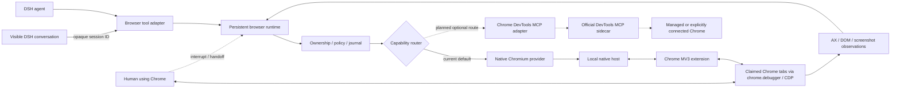

# dsh-native-browser

> DSH-native control plane for fast, observable and human-steerable browsing in the Chrome you already use.

[](#project-status)
[](#scope)
[](LICENSE)

`dsh-native-browser` lets DSH agents operate the Chrome you already use: existing tabs, signed-in sessions and normal extensions, with low-latency semantic observation, reliable actions, visible handoff and safe interruption.

This project is not trying to become another general-purpose Chrome MCP server. Google's official [Chrome DevTools for agents](https://github.com/ChromeDevTools/chrome-devtools-mcp) is the natural upstream capability layer for DevTools inspection, network analysis, performance traces, Lighthouse, CSS and memory debugging. `dsh-native-browser` focuses on the product layer that a generic MCP server does not own: DSH conversation identity, exact tab ownership, short-lived leases, approval policy, action-result semantics, visible agent presence and immediate human takeover.

The target is not another thin `click(x, y)` wrapper. The design is a stateful browser runtime inspired by the strongest parts of Codex's Chrome integration:

- a Manifest V3 Chrome extension connected to a local runtime through Native Messaging;
- CDP-backed control without launching a second browser profile;
- accessibility-tree-first observation with compact incremental updates;
- stable element references plus actionability and hit-target checks;
- explicit ownership for existing tabs, agent-created tabs and end-of-turn cleanup;
- automatic control release when the visible DSH UI switches to another conversation;
- immediate human interruption and resumable handoff;
- a presentation-only virtual pointer and click/wheel pulse after verified browser input;
- screenshots as a visual fallback, not the default source of page structure.

## Positioning

The long-term direction is **DSH-native orchestration with first-party Chrome capabilities where they fit**, not a fork of Chrome DevTools.

| Concern | Chrome DevTools for agents | `dsh-native-browser` |
|---|---|---|
| Primary job | General MCP/CLI access to Chrome DevTools | DSH-native personal-browser control and human-agent UX |
| Browser state | Managed profile, debugging endpoint or Chrome auto-connect | Explicitly claimed tabs in the user's existing profile |
| Observation | Accessibility snapshot with reusable UIDs | Bounded AX windows, document epochs, scoped refs and incremental observations |
| Action result | Browser input dispatch plus bounded navigation/DOM settling | Pre-dispatch hit validation, persistent action journal and verified/unknown outcome semantics |
| Ownership | Selected page or explicit page ID | DSH owner, tab lease, conversation-focus revocation and handoff |
| Human visibility | Headed browser; visual cursor is not currently built in | Presentation-only virtual pointer, click/wheel pulse and extension Stop control |
| Deep debugging | Network, console, CSS, Lighthouse, trace and heap tooling | Planned through an optional official DevTools provider instead of reimplementation |
| Browser scope | Official support for Chrome and Chrome for Testing | Chrome first, with portable contracts and early Edge compatibility gates |

The current alpha ships only the native Chromium path. An adapter for `chrome-devtools-mcp` is a planned provider, not an implemented feature. It must pass attachment-conflict, lifecycle, privacy and latency gates before it can share or replace any part of an active browser session. See the upstream discussions on [visual cursor support](https://github.com/ChromeDevTools/chrome-devtools-mcp/issues/2401) and [silent input false positives](https://github.com/ChromeDevTools/chrome-devtools-mcp/issues/2199) for two examples of why the DSH control plane remains useful.

## Product benchmark: Codex

The experience benchmark is the browser integration in OpenAI Codex: browser work should feel like one continuous, observable collaboration rather than a chain of disconnected remote calls. The goal is experience parity where it can be measured, not protocol compatibility, visual imitation or use of private OpenAI implementation details.

`dsh-native-browser` specifically benchmarks the following behaviors:

- **Use the browser the user is already in:** preserve signed-in state, open tabs and normal Chrome extensions instead of making routine work start in a disposable automation profile.
- **Keep the fast path semantic:** inspect compact accessible state and stable element references first; use screenshots and vision only when pixels contain necessary information.
- **Make actions both visible and trustworthy:** show a virtual pointer for human observability, revalidate the hit target immediately before input, and verify the resulting page state instead of treating input dispatch as success.
- **Let the human remain in charge:** Stop, direct user interaction, handoff, lease expiry and switching the visible DSH conversation revoke control without transferring authority to another conversation.
- **Preserve continuity without leaking ownership:** keep browser connections and observations alive across tool calls while binding every tab, reference and continuation to its owner, document epoch and connection epoch.
- **Leave the workspace clean:** distinguish claimed user tabs from agent-created tabs, close ephemeral work and retain only explicit deliverables or handoffs.

Parity claims require evidence. Release gates should track end-to-end action latency, observation size, stale-target rate, verified-action success, duplicate-action rate, interruption latency, conversation-switch revocation and tab-cleanup correctness on real Chrome workflows. Until those gates pass broadly, this README describes Codex as the benchmark—not as a completed equivalence claim.

## Project status

**Public alpha — usable for opt-in Chrome testing, not production-ready.** The package contains a typed runtime, per-user Broker, Native Messaging host, shared Chrome/Edge extension builds, a Chromium AX/action provider, a small DSH Web foreground-conversation bridge and nine DSH tools, including bounded live page windows, separately approved action batches and metadata-only frame discovery. Chrome setup is still manual, the extension is loaded unpacked, and broad page compatibility, visual-model accuracy and production hardening remain acceptance work rather than completed claims.

Verified so far: deterministic contract/security tests; exact npm tarball installation into a fresh DSH `0.1.5-rc.1` profile; the assembled local stack in isolated Chrome-for-Testing profiles; and one end-to-end run in an existing local Chrome profile on an owned fixture. The real MV3 extension, Chrome-started Native Host, Unix socket, Broker, installed DSH ToolRuntime, AX actions, screenshot attachment and handoff paths were exercised. Live gates also cover delayed results, cancellation, Stop, late approval after turn end, and Broker restart without replay. No sensitive business account workflow or production visual-model accuracy claim has passed acceptance yet. See [development setup](docs/development.md) and [implementation progress](docs/implementation-progress.md) for exact evidence and limitations.

The early Edge compatibility smoke also passes in an isolated Edge profile with the same runtime-core: 20 unchanged executor fixture oracles plus batch, paging, navigation, Stop and handoff checks. This is an architecture gate, not formal Edge release support; see [the retained evidence](docs/compatibility/2026-09-12-edge-native.json).

## Scope

Frame discovery now maps same-process and recursive OOPIF documents in real isolated Chrome and Edge tests. Explicit `browser_observe` frame reads support a same-origin ancestor chain, with separate child refs/deltas and exact child-document or known-region queries via `frame` + `query` + optional `rootRef`; `browser_read_page({frame,...})` provides bounded child-document/region windows; and explicit same-origin/same-process child clicks use `browser_act({frame,...})` with child-only text verification, including feedback outside the default bounded view. Other child actions and cross-origin approval remain pending. Frame origins alone are metadata, not permission. Screenshot checks inspect all attached sessions; visible top-level iframe branches containing foreign or opaque descendants are redacted inside MV3 before bytes cross Native Messaging, while incomplete geometry still fails closed. See [frame discovery](docs/development.md#frame-discovery-foundation).

In scope for the first production release:

- Google Chrome stable on macOS first; Windows/Linux support follows separate installer and compatibility gates;
- the user's existing Chrome profile and authenticated sessions;
- DSH `web` and `desktop` profiles;
- semantic browsing, screenshots, downloads, dialogs, files and multi-tab workflows;
- local-only control plane with explicit permissions and auditable lifecycle events.

Architectural interfaces are cross-browser from day one. Deferred production support includes:

- Edge and other Chromium brands (shared engine; early smoke testing before formal support), Firefox and Safari (separate providers);
- hosted/remote browser farms;
- CAPTCHA bypass or stealth claims;
- arbitrary unrestricted CDP exposed directly to the model.

## Planned architecture



The runtime keeps live browser objects and event subscriptions out of the model context. The model receives compact, typed observations and stable references; the runtime performs freshness, visibility, stability and hit-target checks immediately before actions. The capability router will expose a small DSH-facing surface and choose an eligible provider internally, so adding DevTools or future Edge/Firefox providers does not flood the model with dozens of vendor-specific tools.

The planned DevTools adapter is complementary: routine browsing, leases, virtual pointer and human handoff remain on the native control path; specialized debugging can delegate to the official implementation. The router will not assume that two providers can attach to the same target concurrently.

The current design is the [v2 runtime implementation plan](docs/plans/browser-runtime-plan-v2.zh-CN.md), including [Vision Router integration](docs/plans/vision-router-integration.zh-CN.md). Earlier [architecture](docs/architecture.md), [research](docs/research/codex-chrome-browser-architecture.md) and [protocol](docs/protocol.md) documents are historical inputs; they do not override the v2 plan or describe all current implementation details.

## DSH discovery metadata

The package is structured as a DSH bundle and includes the discovery terms used by the ecosystem:

- npm keywords: `dsh-plugin`, `deepseek-harness`, `browser-automation`, `computer-use`, `chrome-extension`;
- GitHub topics: `dsh-plugin`, `deepseek-harness`, `browser-automation`, `computer-use`, `browser-agent`;
- bundle declaration: `dsh.bundle.patch` in `package.json`;
- compatibility declaration for DSH `0.1.5` release candidates and the `web`/`desktop` profiles.

## Install the alpha

Prerequisites: macOS, Google Chrome, DSH `0.1.5-rc.1`, Node.js 22.19 or newer, and pnpm 11. The npm package ships built JavaScript and does not run a build script during installation.

```bash
dsh plugin --profile web add dsh-native-browser@0.1.0-alpha.2
dsh plugin --profile web exec dsh-native-browser extension-path --browser=chrome
```

Open `chrome://extensions`, enable Developer mode, choose **Load unpacked**, and select the printed directory. Record Chrome's generated 32-character extension ID, then register the Native Messaging host:

```bash
dsh plugin --profile web exec dsh-native-browser install-host --browser=chrome --extension-id=<extension-id>
```

Start the local Broker with an explicit allowlist. Origins are exact and include the port; repeat `--allow-origin` for additional sites:

```bash
dsh plugin --profile web exec dsh-native-browser broker --allow-origin=https://example.com
```

Open an allowed page in Chrome, click the extension, approve that tab, then restart the DSH profile. `approvalMode` defaults to `per-action`. Advanced testers can choose `per-lease`, or `trusted` with a non-empty exact `trustedOrigins` list, in the `native-browser` row of their profile patch. Trusted mode removes repeated DSH prompts only for those exact origins; extension consent, live lease checks, Stop and origin checks still apply. See the [explicit setup and diagnostic guide](docs/development.md#explicit-chromeprofile-setup) before using a signed-in page.

For a personal Chrome profile, the explicit personal mode makes an allowed tab prompt-free and follows that same tab across credential-free HTTP(S) root navigations:

```bash
dsh plugin --profile web exec dsh-native-browser broker --access-mode=personal
```

```yaml
- id: native-browser
  config:
    approvalMode: personal
```

The Broker and adapter settings must both be present or the claim fails closed. The extension negotiates the Broker's explicit personal-mode capability at startup and then exposes ordinary HTTP(S) tabs without a popup click; a claim still selects one tab and every operation remains fenced by its short tab-scoped lease. The development manifest declares HTTP(S) host access, which Chrome presents when the extension is installed, so personal mode and the virtual pointer remain available after cross-site navigation. Foreground-conversation switching, lease expiry, handoff, disconnect and the extension Stop button revoke control. This alpha has no reliable semantic classifier for payments, publishing or destructive actions, so do not use personal mode for those workflows.

When the visible DSH UI changes conversations, the client bridge releases browser scopes owned by other conversations before the newly selected conversation can claim control. A new conversation never inherits the previous lease. Switching away therefore intentionally interrupts an in-flight browser task instead of letting a background chat keep driving Chrome.

## Development

Prerequisites: Node.js 22.19 or newer and pnpm 11.

```bash
pnpm install
pnpm check
pnpm test
pnpm test:chrome
pnpm pack
```

Only the explicitly versioned alpha is recommended for testing. Do not use it for payments, destructive business actions, password entry, or unattended operation.

See [CONTRIBUTING.md](CONTRIBUTING.md) before opening a change. Security-sensitive findings should follow [SECURITY.md](SECURITY.md), not a public issue.

## Acknowledgements

This project is informed by excellent work across the browser-agent ecosystem:

- [Chrome DevTools for agents](https://github.com/ChromeDevTools/chrome-devtools-mcp), maintained by Google ChromeDevTools, demonstrates how a standards-based MCP surface can make Chrome automation, debugging and performance analysis broadly available. Its DevTools capabilities are the preferred future integration path where they fit.
- [OpenAI Codex](https://openai.com/codex/) inspired the product target of a browser that feels continuous, visible and easy to hand back to the human. `dsh-native-browser` is an independent implementation based on public behavior and documentation; it is not affiliated with or endorsed by OpenAI.
- [DeepSeek Harness](https://github.com/deepseek-ai/deepseek-harness) provides the plugin, profile, tool and approval model this package is built for.
- [Chrome DevTools Protocol](https://chromedevtools.github.io/devtools-protocol/), Chromium Accessibility and the Chrome Extensions platform provide the browser primitives behind the native provider.
- [Puppeteer](https://github.com/puppeteer/puppeteer) and [Playwright](https://github.com/microsoft/playwright) provide valuable reference implementations for resilient browser lifecycle, locators, actionability and testing.
- [dsh-vision-router](https://github.com/ysr666/dsh-vision-router) helped shape the optional visual fallback boundary: screenshots and vision complement semantic observation instead of replacing it.

Names and trademarks belong to their respective owners. Acknowledgement does not imply sponsorship or endorsement. Third-party source incorporated in the future will retain its required license and notice information.

## Design principles

1. **Fast paths are semantic.** Use AX/DOM state for routine work and images only where pixels carry essential meaning.
2. **Actions verify reality.** Resolve targets fresh, scroll, wait for stability, hit-test, act, then observe the resulting change.
3. **Browser state has an owner.** Existing user tabs are claimed and released; agent tabs are tracked and cleaned up.
4. **Human control wins immediately.** User interaction or an extension stop action cancels in-flight work and produces a resumable state.
5. **Conversation focus is a control boundary.** Switching the visible DSH conversation revokes background browser scopes; authority is released, never transferred.
6. **Capabilities are explicit.** Sensitive operations are narrow, policy-gated and auditable; raw CDP is an internal transport.
7. **Performance is measured.** Latency, observation size, stale-reference rate, action success and recovery behavior are benchmark gates.

The virtual pointer improves observability, but is never an input primitive: semantic discovery and last-moment hit testing choose the target first, the browser dispatches the real input, and only then does the extension draw the pointer. A drawing failure cannot authorize, retarget, delay or replay an action.

## License

[MIT](LICENSE)
