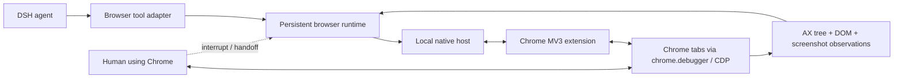

# dsh-native-browser

> Chrome-first browser runtime for DeepSeek Harness, designed for fast, observable, human-steerable agent browsing.

[](#project-status)
[](#scope)
[](LICENSE)

`dsh-native-browser` aims to let DSH agents operate the Chrome you already use: existing tabs, signed-in sessions and normal extensions, with low-latency semantic observation, reliable actions, visible handoff and safe interruption.

The target is not another thin `click(x, y)` wrapper. The design is a stateful browser runtime inspired by the strongest parts of Codex's Chrome integration:

- a Manifest V3 Chrome extension connected to a local runtime through Native Messaging;
- CDP-backed control without launching a second browser profile;
- accessibility-tree-first observation with compact incremental updates;
- stable element references plus actionability and hit-target checks;
- explicit ownership for existing tabs, agent-created tabs and end-of-turn cleanup;
- immediate human interruption and resumable handoff;
- screenshots as a visual fallback, not the default source of page structure.

## Project status

**Pre-alpha / architecture and protocol phase.** The repository currently contains a valid DSH bundle scaffold, research, architecture decisions and validation checks. It does **not** register browser tools yet and should not be presented as production-ready.

The first usable milestone is a Chrome-only vertical slice: connect an extension, claim or create one tab, observe its accessibility tree, navigate, click and type, then release it safely.

## Scope

In scope for the first production release:

- Google Chrome stable on macOS, Windows and Linux;
- the user's existing Chrome profile and authenticated sessions;
- DSH `web` and `desktop` profiles;
- semantic browsing, screenshots, downloads, dialogs, files and multi-tab workflows;
- local-only control plane with explicit permissions and auditable lifecycle events.

Out of scope until Chrome is excellent:

- Edge, Chromium variants, Firefox and Safari;
- hosted/remote browser farms;
- CAPTCHA bypass or stealth claims;
- arbitrary unrestricted CDP exposed directly to the model.

## Planned architecture



The runtime keeps live browser objects and event subscriptions out of the model context. The model receives compact, typed observations and stable references; the runtime performs freshness, visibility, stability and hit-target checks immediately before actions.

Read the [target architecture](docs/architecture.md), [Codex Chrome research](docs/research/codex-chrome-browser-architecture.md), [wire protocol draft](docs/protocol.md) and [roadmap](docs/roadmap.md).

## DSH discovery metadata

The package is structured as a DSH bundle and includes the discovery terms used by the ecosystem:

- npm keywords: `dsh-plugin`, `deepseek-harness`, `browser-automation`, `computer-use`, `chrome-extension`;
- GitHub topics: `dsh-plugin`, `deepseek-harness`, `browser-automation`, `computer-use`, `browser-agent`;
- bundle declaration: `dsh.bundle.patch` in `package.json`;
- compatibility declaration for DSH `0.1.5` release candidates and the `web`/`desktop` profiles.

## Development

Prerequisites: Node.js 22.19 or newer and pnpm 11.

```bash
pnpm install
pnpm check
pnpm test
pnpm pack --dry-run
```

Do not publish or recommend installation yet. Once the first vertical slice is available, the intended command will be:

```bash
dsh plugin --profile web add dsh-native-browser
```

See [CONTRIBUTING.md](CONTRIBUTING.md) before opening a change. Security-sensitive findings should follow [SECURITY.md](SECURITY.md), not a public issue.

## Design principles

1. **Fast paths are semantic.** Use AX/DOM state for routine work and images only where pixels carry essential meaning.
2. **Actions verify reality.** Resolve targets fresh, scroll, wait for stability, hit-test, act, then observe the resulting change.
3. **Browser state has an owner.** Existing user tabs are claimed and released; agent tabs are tracked and cleaned up.
4. **Human control wins immediately.** User interaction or an extension stop action cancels in-flight work and produces a resumable state.
5. **Capabilities are explicit.** Sensitive operations are narrow, policy-gated and auditable; raw CDP is an internal transport.
6. **Performance is measured.** Latency, observation size, stale-reference rate, action success and recovery behavior are benchmark gates.

## License

[MIT](LICENSE)
