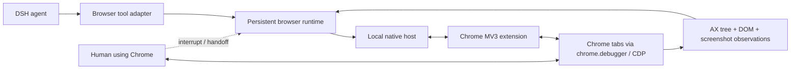

# dsh-native-browser

> Chrome-first browser runtime for DeepSeek Harness, designed for fast, observable, human-steerable agent browsing.

[](#project-status)
[](#scope)
[](LICENSE)

`dsh-native-browser` aims to let DSH agents operate the Chrome you already use: existing tabs, signed-in sessions and normal extensions, with low-latency semantic observation, reliable actions, visible handoff and safe interruption.

The target is not another thin `click(x, y)` wrapper. The design is a stateful browser runtime inspired by the strongest parts of Codex's Chrome integration:

- a Manifest V3 Chrome extension connected to a local runtime through Native Messaging;
- CDP-backed control without launching a second browser profile;
- accessibility-tree-first observation with compact incremental updates;
- stable element references plus actionability and hit-target checks;
- explicit ownership for existing tabs, agent-created tabs and end-of-turn cleanup;
- immediate human interruption and resumable handoff;
- screenshots as a visual fallback, not the default source of page structure.

## Project status

**Development preview — implementation in progress, not production-ready.** The repository now contains a typed runtime, per-user Broker, Native Messaging host, shared Chrome/Edge extension builds, a Chromium AX/action provider and nine DSH tools, including bounded live page windows, separately approved action batches and metadata-only frame discovery. Existing-user-profile extension integration, vision-model accuracy, broad page compatibility and release hardening are still acceptance work, not completed claims.

Verified so far: deterministic contract/security tests and the assembled local stack in an isolated Chrome-for-Testing profile: real MV3, Chrome-started Native Host, Unix socket, Broker, installed DSH ToolRuntime and image attachments. Live checks cover input, delayed results, cancellation, Stop, late approval after turn end, and Broker restart without replay. No model/vision call or real signed-in business account has passed acceptance yet. See [development setup](docs/development.md) and [implementation progress](docs/implementation-progress.md) for exact evidence and limitations.

The early Edge compatibility smoke also passes in an isolated Edge profile with the same runtime-core: 20 unchanged executor fixture oracles plus batch, paging, navigation, Stop and handoff checks. This is an architecture gate, not formal Edge release support; see [the retained evidence](docs/compatibility/2026-09-12-edge-native.json).

## Scope

Frame discovery now maps same-process and recursive OOPIF documents in real isolated Chrome and Edge tests. Explicit `browser_observe` frame reads now support a same-origin ancestor chain, with separate child refs/deltas and exact child-document or known-region queries via `frame` + `query` + optional `rootRef`; explicit same-origin/same-process child clicks now use `browser_act({frame,...})` with child-only text verification; other child actions and cross-origin approval remain pending. Frame origins alone are metadata, not permission. Screenshot checks inspect all attached sessions so an OOPIF omitted from the root tree cannot bypass the origin gate. See [frame discovery](docs/development.md#frame-discovery-foundation).

In scope for the first production release:

- Google Chrome stable on macOS first; Windows/Linux support follows separate installer and compatibility gates;
- the user's existing Chrome profile and authenticated sessions;
- DSH `web` and `desktop` profiles;
- semantic browsing, screenshots, downloads, dialogs, files and multi-tab workflows;
- local-only control plane with explicit permissions and auditable lifecycle events.

Architectural interfaces are cross-browser from day one. Deferred production support includes:

- Edge and other Chromium brands (shared engine; early smoke testing before formal support), Firefox and Safari (separate providers);
- hosted/remote browser farms;
- CAPTCHA bypass or stealth claims;
- arbitrary unrestricted CDP exposed directly to the model.

## Planned architecture



The runtime keeps live browser objects and event subscriptions out of the model context. The model receives compact, typed observations and stable references; the runtime performs freshness, visibility, stability and hit-target checks immediately before actions.

The current design is the [v2 runtime implementation plan](docs/plans/browser-runtime-plan-v2.zh-CN.md), including [Vision Router integration](docs/plans/vision-router-integration.zh-CN.md). Earlier [architecture](docs/architecture.md), [research](docs/research/codex-chrome-browser-architecture.md) and [protocol](docs/protocol.md) documents are historical inputs; they do not override the v2 plan or describe all current implementation details.

## DSH discovery metadata

The package is structured as a DSH bundle and includes the discovery terms used by the ecosystem:

- npm keywords: `dsh-plugin`, `deepseek-harness`, `browser-automation`, `computer-use`, `chrome-extension`;
- GitHub topics: `dsh-plugin`, `deepseek-harness`, `browser-automation`, `computer-use`, `browser-agent`;
- bundle declaration: `dsh.bundle.patch` in `package.json`;
- compatibility declaration for DSH `0.1.5` release candidates and the `web`/`desktop` profiles.

## Development

Prerequisites: Node.js 22.19 or newer and pnpm 11.

```bash
pnpm install
pnpm check
pnpm test
pnpm test:chrome
pnpm pack
```

Do not publish or recommend production installation yet. Local development builds can be exercised using [the explicit opt-in setup](docs/development.md). The intended public installation command remains:

```bash
dsh plugin --profile web add dsh-native-browser
```

See [CONTRIBUTING.md](CONTRIBUTING.md) before opening a change. Security-sensitive findings should follow [SECURITY.md](SECURITY.md), not a public issue.

## Design principles

1. **Fast paths are semantic.** Use AX/DOM state for routine work and images only where pixels carry essential meaning.
2. **Actions verify reality.** Resolve targets fresh, scroll, wait for stability, hit-test, act, then observe the resulting change.
3. **Browser state has an owner.** Existing user tabs are claimed and released; agent tabs are tracked and cleaned up.
4. **Human control wins immediately.** User interaction or an extension stop action cancels in-flight work and produces a resumable state.
5. **Capabilities are explicit.** Sensitive operations are narrow, policy-gated and auditable; raw CDP is an internal transport.
6. **Performance is measured.** Latency, observation size, stale-reference rate, action success and recovery behavior are benchmark gates.

## License

[MIT](LICENSE)
