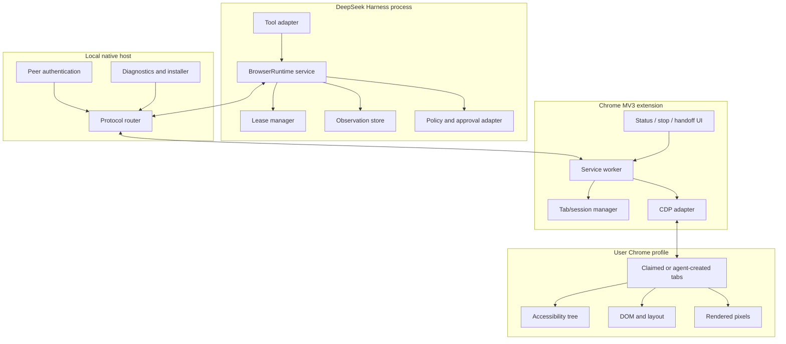
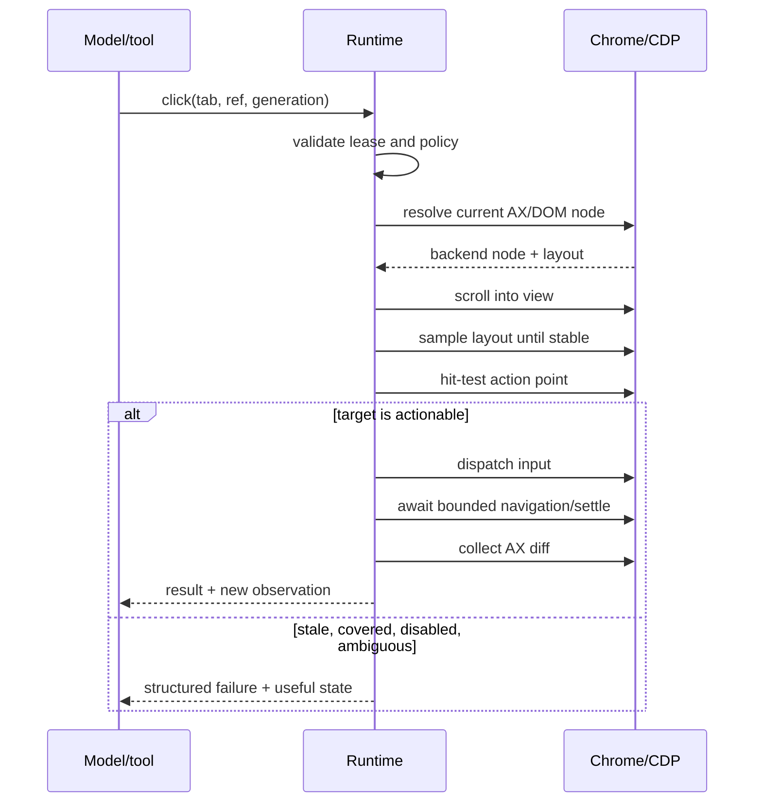

# Chrome-first target architecture

## 1. Objective

`dsh-native-browser` should make browser work feel like a continuous collaboration with the user's real Chrome, not a sequence of disconnected remote procedure calls. The first production target is Google Chrome only. Cross-browser abstraction is deliberately deferred until the Chrome path is reliable, fast and secure.

The architecture is optimized for five properties:

1. **Continuity:** browser, tab and element state persist across model steps.
2. **Semantic efficiency:** the default observation is a compact accessibility representation and its changes.
3. **Action reliability:** every consequential action revalidates the current page immediately before execution.
4. **Human authority:** the user can watch, take over, interrupt and return control without corrupting state.
5. **Least capability:** DSH sees narrow browser operations; unrestricted CDP is not a model-facing API.

## 2. System decomposition



### DSH bundle

The distributed npm package is a DSH bundle. Its `cordis.patch.yml` will eventually mount three rows:

- `native-browser-runtime`: a `ctx.nativeBrowser` service that owns connection, sessions, leases and observations;
- `native-browser-tools`: a deliberately small model-facing control surface;
- `native-browser-lifecycle`: turn/session hooks for cancellation, cleanup and handoff.

Registration must be effect-based so hot reload and plugin disposal unwind tools, listeners, transports and active debugger attachments.

### Persistent runtime

The runtime is the source of truth. It owns long-lived objects while the model sees serializable handles:

```text
BrowserSession
  id
  chromeInstance
  connectionEpoch
  turnId
  tabs: Map<TabHandle, TabLease>
  activeOperations: Map<OperationId, AbortController>

TabLease
  handle
  chromeTabId
  ownership: claimed | created
  disposition: ephemeral | deliverable | handoff
  generation
  observation
```

Chrome's integer tab IDs never cross the model boundary. They are browser-session-local implementation details and may be reused. Public handles are opaque and bound to a connection epoch.

### Native host

Chrome Native Messaging is the primary extension-to-local bridge. It avoids opening a remotely reachable debug port and lets Chrome restrict which extension origin can launch the host. The host has three responsibilities:

- frame and validate the versioned protocol;
- authenticate the DSH runtime and extension instance;
- route requests, events, cancellation and health information without interpreting webpage instructions.

The host must write protocol frames only to stdout; logs go to stderr. Install/uninstall code must be explicit, reversible and independently testable on macOS, Windows and Linux.

### Chrome extension

The extension is Manifest V3 and uses a service worker. Its global memory is disposable by design. Durable connection and lease metadata lives in `chrome.storage.session` or the native runtime; every event handler must be able to reconstruct state after service-worker restart.

The extension uses:

- `chrome.runtime.connectNative()` for the long-lived local channel;
- `chrome.tabs` and `chrome.tabGroups` for user-visible tab management;
- `chrome.debugger` as the CDP transport for claimed tabs;
- `chrome.webNavigation`, downloads and dialog events where Chrome APIs give a better lifecycle signal;
- a small side panel or action popup for status, stop, release and connection diagnostics.

The extension does not expose a localhost WebSocket to arbitrary pages. If a loopback transport becomes necessary later, it requires per-install secrets, Origin validation, short-lived session tokens and bind-to-loopback enforcement.

## 3. Observation pipeline

### AX-first state

On attach, enable the CDP Accessibility domain and obtain a full accessibility tree. Normalize it into an agent-oriented tree:

- retain role, accessible name, value, state and relationships;
- retain actionable and content-bearing nodes plus the minimum ancestor path needed for context;
- collapse repetitive or layout-only nodes;
- assign opaque refs derived from stable backend identity, not array position;
- impose node, text, depth and serialized-byte limits.

After the initial snapshot, consume AX change events and navigation/lifecycle signals. Produce an observation envelope with both `generation` and `baseGeneration`. If continuity is lost, send a bounded full snapshot and explicitly mark the reset.

```text
Observation = {
  tab, url, title,
  generation, baseGeneration,
  kind: full | diff,
  added, changed, removed,
  focus, dialogs, navigation
}
```

An element ref is accepted only when its tab, connection epoch and generation rules still hold. Stale references fail with a structured `STALE_TARGET` result and a refreshed local observation; they never degrade silently to the same coordinates.

### DOM and layout augmentation

Accessibility is not sufficient for all pages. The runtime may resolve an AX node to a backend DOM node and request content quads, box model, scroll state and hit-test information. A bounded DOM snapshot supports pages whose AX tree is incomplete, while frame transforms map nested-frame coordinates into the top-level viewport.

DOM data augments an operation; it is not returned wholesale by default. Full HTML is noisy, can contain secrets and amplifies prompt injection.

### Screenshot fallback

Screenshots are requested when:

- the user asks for visual verification;
- the target is canvas, image, chart, map or other pixel-first UI;
- semantic lookup fails or reports ambiguity;
- a final visual deliverable needs inspection.

The runtime captures a tab or bounded viewport directly through CDP. Images have pixel and byte ceilings. Screenshot cadence must be adaptive; taking one after every semantic action is a latency and token regression.

## 4. Action pipeline

All element actions follow the same transaction:



Click actionability includes:

- target resolves exactly once;
- visible, connected and not disabled;
- non-empty content quad intersects the viewport after scrolling;
- layout remains stable for consecutive animation frames or bounded samples;
- the chosen point's hit target is the element or an acceptable descendant;
- no newer cancellation or human-interaction epoch exists.

Typing distinguishes text insertion from key semantics. Text fields use focus plus `Input.insertText` where appropriate; keyboard shortcuts and navigation keys use key events. Selecting options, checking controls, dialogs, file choosers and downloads are typed operations with their own policy gates rather than simulated clicks.

Every operation observes `AbortSignal`. Cancellation wins over retries, waits and post-action collection.

## 5. Tab ownership and lifecycle

There are two ways to acquire a tab:

- **Create:** the runtime creates a new tab and records it as `created/ephemeral`.
- **Claim:** the runtime first lists candidate tabs, then claims an exact `(opaque candidate id, title, URL, connection epoch)` tuple. A changed tuple fails closed.

Claimed tabs remain user-owned. The runtime releases debugger attachment at turn end unless marked for handoff. Created tabs close at turn end unless marked `deliverable` or `handoff`.

Disposition semantics:

- `ephemeral`: close created tabs or detach claimed tabs on normal turn completion;
- `deliverable`: preserve the tab because it is part of the result the user should inspect;
- `handoff`: stop automation, keep the tab visible and wait for user work such as login or CAPTCHA;
- `released`: terminal state; no future action can reuse the handle.

On DSH interruption, all active operations cancel first. Cleanup must be idempotent because the extension, native host and DSH process can each disconnect independently.

## 6. Human interaction model

The extension surface always shows which tab and DSH task currently hold control. A prominent Stop action increments a control epoch and cancels work. Direct human interaction with a controlled tab should either:

1. pause the automation and emit `human_intervened`, or
2. be ignored only for clearly passive interactions such as focusing the window, according to a documented policy.

The runtime never retries through `human_intervened`. The model receives a concise instruction to inspect fresh state or ask the user whether to continue.

Handoff is not an error. It is a first-class state with a reason, visible UI, retained lease and explicit resume handshake.

## 7. Model-facing API

The long-term API should keep the permanently visible tool count small. Two candidate shapes will be benchmarked:

- a compact family of typed tools such as `browser_connect`, `browser_observe`, `browser_act`, `browser_handoff`;
- a single sandboxed, persistent JavaScript tool over frozen capability objects.

The JS shape is closer to Codex and enables local batching, but it creates a second security boundary. If chosen, the evaluator must expose no Node globals, module loading, filesystem, raw network, dynamic import, prototypes that escape the sandbox or unbounded serialization. Read-only page evaluation is separate from host-side control code.

Regardless of shape, raw CDP commands remain unavailable by default. A future developer mode must be explicitly enabled and approved per target origin.

## 8. Reliability and performance gates

The first public beta must meet these gates on deterministic fixtures and a rotating real-site suite:

| Measure | Beta gate |
|---|---:|
| Warm `observe` latency | p50 < 150 ms, p95 < 500 ms |
| Click to useful settled diff, excluding real navigation | p50 < 350 ms, p95 < 1.5 s |
| AX diff bytes vs repeated full snapshots | median reduction >= 60% |
| Stale ref causes wrong action | 0 |
| Cross-task tab access | 0 |
| Ephemeral tab leak after normal/interrupt/crash tests | 0 |
| MV3 service-worker restart recovery | >= 99% in stress suite |
| Human stop to operation cancellation | p95 < 250 ms |

Benchmarks must publish hardware, Chrome version, page fixture revision, cold/warm classification and percentile distributions. “Feels fast” is useful product feedback but not a release criterion.

## 9. Failure taxonomy

Failures are stable, typed and actionable:

- `NOT_CONNECTED`: extension/native host unavailable;
- `VERSION_MISMATCH`: protocol ranges do not overlap;
- `TAB_NOT_FOUND`: Chrome tab disappeared;
- `TAB_NOT_CLAIMED`: operation does not own the tab;
- `STALE_TARGET`: reference is no longer valid;
- `TARGET_AMBIGUOUS`: semantic locator resolves more than once;
- `TARGET_NOT_ACTIONABLE`: hidden, disabled, moving or covered;
- `NAVIGATION_BLOCKED`: destination rejected by policy;
- `APPROVAL_REQUIRED`: DSH approval must be resolved;
- `HUMAN_INTERVENED`: user stopped or took control;
- `OPERATION_ABORTED`: caller cancellation;
- `CHROME_RESTRICTED`: Chrome/enterprise policy blocks debugger or capture;
- `INTERNAL_PROTOCOL_ERROR`: invalid or inconsistent peer message.

Retries are error-specific and bounded. Permission, ownership, human intervention and stale-target failures never retry invisibly.

## 10. Packaging boundary

The repository will grow into a workspace only when the first runtime components exist. Intended packages:

```text
packages/
  dsh-plugin/       DSH bundle, service and tools
  protocol/         versioned schemas and generated TypeScript types
  native-host/      stdio host and platform installer
  chrome-extension/ Manifest V3 extension
  test-pages/       deterministic browser fixtures
```

The Chrome extension and native host need independent versions, but the protocol advertises a compatibility range. Releases include checksums and reproducible build instructions. GitHub installs must not require unreviewed build scripts; npm packages should ship built artifacts.
