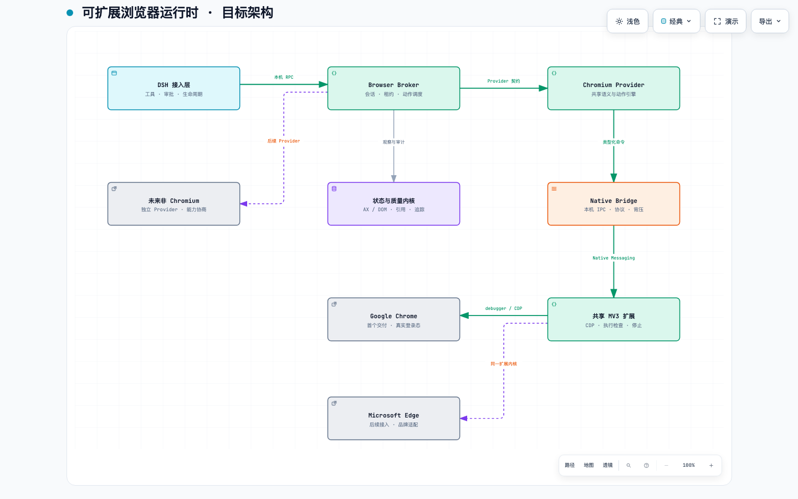
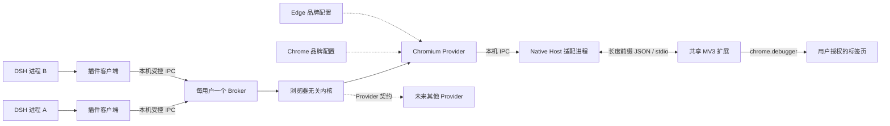
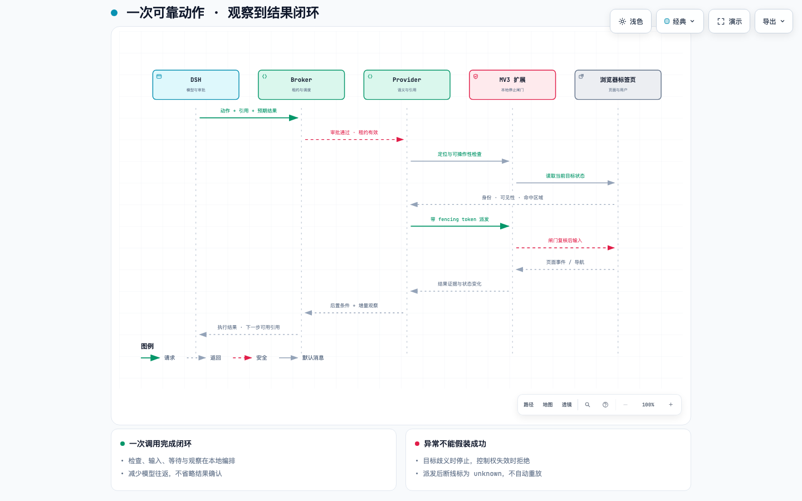
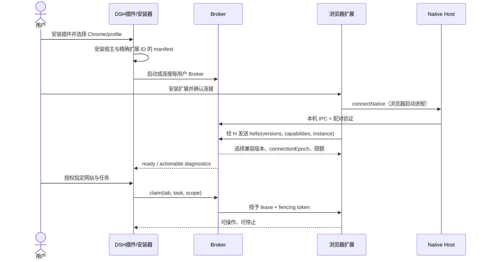
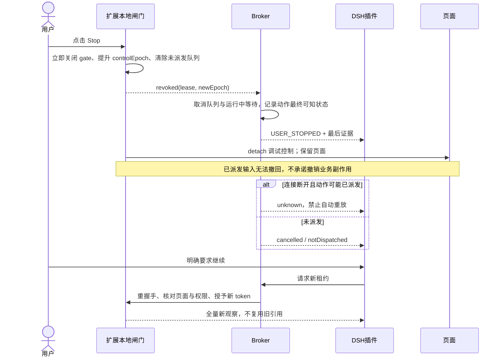
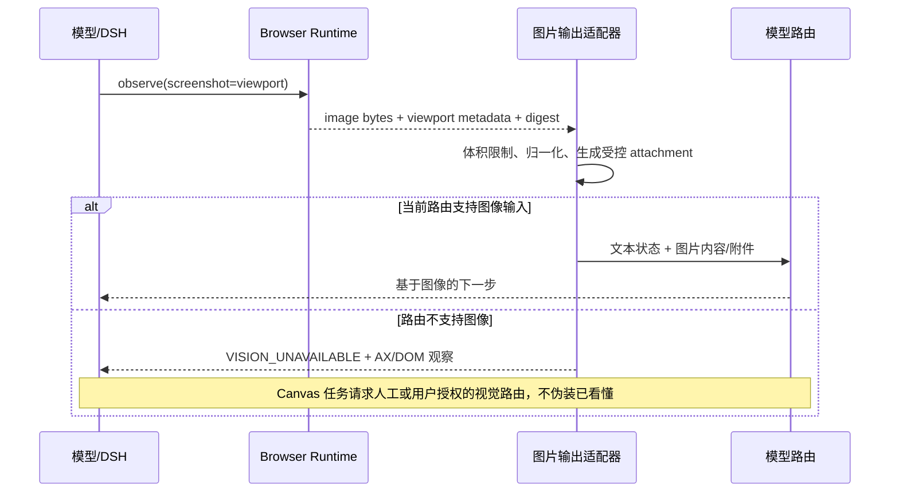

# DSH Native Browser：可扩展浏览器运行时架构与实施计划

> 版本：v2 · 2026-09-11 · 状态：设计提案，尚未实现或压测。首个交付面向 macOS + Chrome；架构从第一天支持多浏览器。性能数值均为拟定验收目标，不是 Codex 的公开数据，也不是本项目已有成绩。

## 1. 决策摘要

**建设一个浏览器无关的本地 Browser Runtime，先把 Chrome Provider 做到可日常使用；Chrome 与 Edge 共享 Chromium 引擎，通过品牌适配器处理安装、扩展 ID、权限与能力差异。**

最终产品不是一组 `click/screenshot` 命令，而是可靠的“观察 → 选择 → 授权 → 检查 → 动作 → 验证 → 增量观察”闭环。丝滑来自持续连接、少而完整的工具调用、低噪声状态、明确的等待条件、准确定位、可靠人工接管，以及模型本身的能力。

核心决策：

1. 首日定义 Provider、Transport、Observation、Action、Policy 五类契约；不等支持 Edge 时再重构。
2. 使用每个操作系统用户一个本地 Broker，统一管理多个 DSH 进程、浏览器 profile 和标签页租约。
3. Chrome 首选 MV3 扩展 + `chrome.debugger` + Native Messaging，沿用用户真实登录态，不要求重启个人浏览器开启远程调试端口。
4. AX 语义定位优先，DOM 提供结构与几何补充，截图用于语义不足的页面；坐标操作不是默认路径。
5. 每次动作自带当前状态验证与结果证据；失败有准确分类，断线后不盲目重放。
6. 稳定运行时与类型化批处理先交付；模型端持久 JavaScript REPL 后置，且不能绕过权限。
7. Stop、租约、取消、图片链路与评测在前两阶段完成，不能作为收尾功能。
8. 通过固定任务集与 Codex 做黑盒对照，不凭演示观感宣称“同等准确”。

本计划更新旧方案中的两点：把“跨浏览器抽象以后再做”改为“接口现在做、实现逐步做”；把“页面版本改变就废弃全部引用”改为分层版本与目标级失效。旧研究可作为历史证据，但后续实现应按本计划建立正式 ADR。

## 2. 对标 Codex：确认了什么，不能确认什么

### 2.1 证据分级

| 级别 | 已有证据 | 可以据此做什么 | 不能据此推导什么 |
|---|---|---|---|
| A：官方文档 | OpenAI 当前浏览器扩展文档包含 Chrome/Edge 等浏览器、登录态、网站权限、桌面任务入口 [^1] | 确定需要兼顾真实 profile、多浏览器、用户可见授权 | 不能推导其全部内部架构、算法、延迟 |
| B：本机安装包观察 | 已检查本机 Codex 浏览器插件的无障碍操作指引、标签页清理指引及桥接入口；插件版本 `26.903.71938` | 观察其 AX/DOM/截图组合、状态差分、批量操作后刷新、任务标签页管理的设计取向 | 不能视为稳定公共 API；不复制专有实现、不依赖私有 native host |
| A：协议与浏览器文档 | Chrome debugger、Native Messaging、MV3、CDP Accessibility；Microsoft 迁移说明 [^2][^3][^4][^5][^6] | 约束我们的可实现边界与版本矩阵 | “都是 Chromium”不意味着能力、权限和部署完全相同 |
| A：DSH 源码 | `deepseek-ai/deepseek-harness` 提交 `c291e7961a515f6d7af9304e7fd1d257929aef26` 的工具、生命周期、代码运行时、图片类型 [^7][^8][^9][^10] | 明确接入点，并将不确定项变成验证任务 | 上游存在 image 类型不等于当前已安装版本的完整视觉链路已经可用 |
| C：设计建议 | 本文接口、调度、状态机、指标与排期 | 作为实现与验收基线 | 尚非已运行产品事实 |

本机代码观察只用于提炼行为需求；可公开复核的依据使用脚注链接。没有读取用户浏览内容、Cookie 或凭据来做研究。

### 2.2 丝滑体验的六个来源

| 用户感受 | 需要建设的机制 | 评测观察量 |
|---|---|---|
| 不反复打开浏览器、重新登录 | 原 profile 扩展接入、稳定连接、显式选择浏览器实例 | 安装步骤、首次可控时间、重连率 |
| 不频繁截图和来回思考 | 语义状态压缩、本地动作闭环、有界批处理 | 模型轮次、上下文 token、截图次数 |
| 点击准确 | 唯一语义匹配、目标身份、可操作性与命中测试 | 错目标率、陈旧引用拒绝率 |
| 不干等 | 基于预期结果的事件等待，统一 deadline | 本地等待开销、超时率 |
| 被打断后不乱动 | 扩展侧停止闸门、租约 fencing、动作日志 | 停止后派发数、重复副作用 |
| 结果可信 | 业务后置条件、截图/文本证据、unknown 状态 | 虚假成功率、真实任务成功率 |

这是对标设计，不是对 Codex 私有实现的完整还原。同一浏览器执行引擎在不同模型上，任务规划、视觉理解与风险判断也会不同。插件只能改善可控的部分。

## 3. 产品范围与非目标

首个公开可用版本：Chrome、macOS、普通 HTTP(S) 页面、用户指定 profile、读取与交互、导航/标签页、表单、iframe、截图、文件上传/下载的受控基础路径、停止与交接、诊断。先私有测试，再公开发布。

从第一天预留：Edge 品牌适配、Windows/Linux 安装器、其他 Provider、不同 DSH 模型与图片能力。Edge 在第二阶段做技术冒烟验证，完整支持不占用 Chrome 首发的功能承诺。

暂不承诺：绕过 CAPTCHA、系统级键鼠、浏览器内部页面、任意扩展页、完全闭合的 Shadow DOM、对抗性页面上的零误操作、跨站业务事务回滚、无人确认的支付/删除/发送、通用网页网络隔离。Firefox/Safari 不能简单换一个品牌配置；未来须单独 Provider，BiDi 是候选协议而非当前兼容承诺。[^11]

## 4. 目标架构

交互式架构图：[打开 HTML](diagrams/browser-architecture.html)。可编辑源：[JSON](diagrams/browser-architecture.json)。图表示逻辑依赖，下面的进程图规定真实运行方向。





**启动关系很重要：扩展调用 `connectNative()`，由浏览器启动 Native Host；Native Host 再连接 Broker。不是 Broker 任意启动一个进程便能反向得到扩展的 Native Messaging 通道。** 使用长连接而非每个动作启动新 host。[^3]

### 4.1 模块职责

| 模块 | 负责 | 不负责 |
|---|---|---|
| `dsh-adapter` | 注册工具、输入输出 schema、审批、取消信号、图片适配、生命周期事件 | CDP、浏览器品牌分支 |
| `vision-adapter` | 优先接入 dsh-vision-router 的公开工具；图片授权、坐标格式、结果归一化 | 点击、控制租约、替视觉模型保证正确性 |
| `runtime-core` | 会话、租约、动作状态机、观察游标、策略接口、结果与错误规范 | Chrome tab ID、扩展注册表路径 |
| `broker` | 每用户仲裁、连接发现、资源限额、调度、短期动作日志、进程恢复 | 模型推理、保存所有网页内容 |
| `provider-chromium` | AX/DOM 观察、定位、动作检查、帧映射、截图几何、事件归一化 | DSH 插件生命周期、安装 UI |
| `browser-chrome/edge` | 扩展 ID、商店入口、通道/profile 识别、安装路径、能力覆盖、兼容策略 | 复制整个 Chromium 执行引擎 |
| `transport-native` | 协议握手、分帧、背压、连接 epoch、请求取消、blob 分块 | 判断“发送邮件”是否获用户批准 |
| `extension-core` | debugger 附着、CDP 转发、浏览器事件、最后一跳租约复核、Stop 闸门 | 任意本机文件读取、任意 shell |
| `installer/doctor` | 宿主注册、配对、权限检查、升级回滚、卸载清理 | 自动关闭用户所有浏览器或清空 profile |
| `evals` | 页面夹具、故障注入、任务 oracle、trace 分析、品牌契约套件 | 仅成功演示作为验收 |

`runtime-core` 不允许引用 `chrome.*` 或 CDP 原生类型。依赖方向由 lint/构建规则守护。事件、错误、能力与截图格式也是 Provider 契约，不只是 `click()` 方法抽象。

### 4.2 技术栈与仓库建议

推荐 TypeScript + pnpm workspace：DSH 接口、核心、Provider 与扩展共享类型；Node 长驻 Broker 降低首期维护成本。Native Host 初期使用薄 Node 入口，安装器验证所需运行时与绝对启动路径；正式分发评估打包为自包含可执行文件。只有 P0 证明启动或分发无法满足要求时才引入 Rust host，不先建设双语言业务层。

```text
packages/
  contracts/             # 稳定类型、JSON Schema、错误码、版本协商
  runtime-core/          # 状态机、租约、策略、观察预算、调度
  broker/                # 本机 daemon 与客户端发现
  dsh-adapter/            # DSH 特有代码与图片输出适配
  vision-adapter/         # dsh-vision-router / 原生视觉 / 无视觉模式
  provider-chromium/     # CDP + AX + DOM + 语义执行
  browser-chrome/        # Chrome 品牌/平台配置
  browser-edge/          # 最初只有配置与冒烟，不宣称正式支持
  transport-native/     # framing、host、连接恢复
  extension-core/       # MV3 service worker、Stop UI
  installer/            # install / doctor / uninstall
  evals/                # fixtures、contract、fault、e2e、benchmark
docs/decisions/          # ADR：协议、权限、生命周期、兼容性
```

Playwright 用于测试夹具和参考可操作性语义，不作为“必然可以直接接到 debugger 转发上的完整运行时”。`chrome.debugger` 只开放一部分 CDP 域；例如不能假定 `Browser.*` 可用。[^2][^12] 可调查 Tencent BrowserSkill 等开源项目的桥接、测试与安装实现，复用前核验具体文件许可和依赖；不把星数当成熟度证据，不复制 Codex 专有代码。[^13]

## 5. 跨浏览器契约：现在设计，逐步实现

下列为建议接口形状，非当前 DSH/Chrome 已有 API。线上的 JSON 不携带 `AbortSignal`；本进程信号转为 `request.cancel` 协议消息。

```ts
type BrowserFamily = "chromium" | "webdriver-bidi" | "other";
type Capability = "ax" | "dom" | "screenshot" | "oopif"
  | "upload" | "download" | "dialogs" | "headless";
interface BrowserInstance {
  id: string;             // 不透明标识，不将用户 profile 绝对路径暴露给模型
  family: BrowserFamily;
  brand: string; channel: string; version: string;
  profileLabel: string;
  capabilities: Partial<Record<Capability, { supported: boolean; reason?: string }>>;
}
interface BrowserProvider {
  discover(): Promise<BrowserInstance[]>;
  connect(instanceId: string, signal: AbortSignal): Promise<BrowserConnection>;
}
interface BrowserConnection {
  listTabs(scope: AuthorizedScope): Promise<TabSummary[]>;
  claim(tab: TabHandle, request: ClaimRequest): Promise<Lease>;
  observe(request: ObserveRequest, signal: AbortSignal): Promise<Observation>;
  act(request: ActionRequest, signal: AbortSignal): Promise<ActionResult>;
  events(): AsyncIterable<BrowserEvent>;
  release(lease: Lease, reason: string): Promise<void>;
  dispose(): Promise<void>;
}
```

Provider 必须明确区分“实现不支持”“当前版本不支持”“权限未授权”“企业策略阻止”“暂时失联”。不能全部抛 `timeout`。

BrowserInstance 至少区分品牌、通道、profile、启动实例。外部 `TabHandle/FrameHandle/NodeRef` 均为不透明 ID；底层 `tabId/targetId/sessionId/backendNodeId` 只在 Chromium Provider 内映射。连接重启不能误把旧 tab ID 绑定到新页面。

Chrome/Edge 共享一个扩展代码库，以品牌 manifest overlay 生成两个构建物；Native Host allowed origins 精确列出各自扩展 ID。平台路径与企业策略分别测，不能从 Chrome 路径推导 Edge 安装完成。Microsoft 说明大多数 Chromium 扩展可迁移，但仍要求逐项审查 API。[^5][^6]

第一阶段就用 FakeProvider 跑核心契约；第二阶段在 Edge 真实跑通 discover → claim → observe → act → stop → release。**若必须修改 runtime-core 才能新增 Edge，视为架构验收失败**（契约缺陷需要 ADR 修订，不允许悄悄散落品牌判断）。

## 6. 观察系统：少而准确，不把整个页面塞进上下文

### 6.1 观察内容与分层版本

Observation 返回：授权后的 URL/标题、页/帧标识、可交互 AX 节点、必要文本、模态框/焦点、loading 状态、截断标记、差分游标、可选截图句柄。页面内容一律标记为不可信数据。

| 标识 | 何时变化 | 用途 |
|---|---|---|
| `connectionEpoch` | host/扩展/Broker 重建连接 | 拒绝旧连接消息 |
| `documentEpoch`（每帧） | 文档更换、帧被替换 | 废弃该文档全部引用 |
| `observationRevision` | 生成新观察 | 客户端差分游标，不作为全局动作失效开关 |
| `nodeVersion` | 目标身份或相关语义变化 | 单目标陈旧检测 |
| `controlEpoch` + fencing token | 人工停止、租约撤销/重新授予 | 阻止旧任务继续操作 |

AX 用于角色、名称、状态；DOM 用于层级、表单约束、节点身份和几何。定位顺序为：最新引用 → 同文档唯一 role/name/上下文组合 → 必要 DOM locator → 截图候选。不能把名称相同的另一个“删除”按钮当作自动恢复目标。

CDP Accessibility 提供树查询与更新事件，但不能当成覆盖全部 DOM 增删的可靠 changefeed。事件用于 dirty 标记；采用定向读取、节流重建、导航全量重建，以及丢事件后的 resync。[^4] 每个消费者保存自己的 diff 游标；落后于缓存窗口返回 `resyncRequired`，不返回错误差分。

建议初始预算：默认观察最多 120 个交互节点、80 KiB 序列化文本，模型端目标约 4k–8k tokens；节点与字节双限制并显式 `truncated`，不可声称固定字节数等于固定 token 数。用户/模型可按区域 expand。大表格按窗口读取，禁止默认列举其他未授权标签页的全文。

### 6.2 帧、页面与几何

建立 `tab → frame → document → executionContext/CDP session` 映射。OOPIF 使用 flat session；同进程 iframe 不等于独立 target。`Target.setAutoAttach` 不是自动无限递归，子 target 必须继续配置。Chrome 125+ 是此方案 flat-session 技术能力门槛，不是所有历史版本的支持声明；实际发布只承诺经过测试的近期稳定版本。[^2]

截图返回 `imageId, viewportCssSize, pixelSize, dpr, scale, scroll, documentEpoch, capturedAt`。坐标执行前重新检查视口、滚动、缩放、帧转换与命中区域；旧截图不能直接套到新页面。跨源帧逐帧检查授权；禁止因父页被允许就静默读取所有第三方帧。

## 7. 动作引擎：把准确性做成协议，而非提示词愿望

### 7.1 动作闭环

一次 `act` 完成：审批校验 → 租约排队 → 目标解析 → 状态/可见性/启用/稳定性/命中测试 → 扩展最终 gate 复核 → 派发输入 → 等待后置条件 → 返回结果和新观察。

交互式时序图：[打开 HTML](diagrams/browser-action-sequence.html)。可编辑源：[JSON](diagrams/browser-action-sequence.json)。跨层返回箭头表示逻辑结果，实际经过 Native Bridge 原路返回。



可操作性借鉴 Playwright：可见、稳定、可接收事件、启用等检查，但各动作适用条件不同。[^12] 输入框还要覆盖 React 受控值、contenteditable、中文 IME/组合输入、只读、maxlength、清空与追加；不得用“设置 DOM value”冒充用户输入成功。

`expected` 可表达字段值、对话框出现/消失、特定元素状态、导航/新标签页、下载完成、结果文本。URL 变化不是所有业务成功的证据；按钮收到 click 也不等于表单已经提交成功。复杂业务结果交给任务 oracle 或模型进一步确认。

等待采用事件 + 有界主动确认，所有阶段共享 deadline。默认建议动作 10 秒、导航 30 秒、批处理 30 秒，可配置；持续网络流、动画不能无限拖住。不要把全局 network-idle 当所有网页的完成条件。

### 7.2 结果与重试语义

```ts
interface ActionResult {
  requestId: string;
  outcome: "succeeded" | "failed" | "cancelled" | "unknown";
  dispatch: "notDispatched" | "dispatched" | "observed";
  code?: "STALE_TARGET" | "AMBIGUOUS_TARGET" | "NOT_ACTIONABLE"
    | "POLICY_DENIED" | "LEASE_REVOKED" | "USER_STOPPED"
    | "UNSUPPORTED_CAPABILITY" | "CONNECTION_LOST" | "DEADLINE_EXCEEDED";
  postcondition: "passed" | "failed" | "unverified";
  observation?: Observation;
  traceId: string;
}
```

这不是数据库事务：检查与输入之间存在页面变化窗口；浏览器无法提供业务层 ACID 或严格 exactly-once。Broker 保留短期 `requestId + payloadHash + dispatch 状态` 去重日志，扩展也维护有界去重窗口；同 ID 不同 payload 拒绝。扩展已派发但 ACK 丢失时只能 `unknown`，不能为追求表面成功自动重发“发送/提交/删除”。

可自动重试：未派发的临时读取/等待；同文档同身份目标的定向重新校验。不可自动重试：目标歧义、权限失败、用户停止、无法确认是否生效的副作用。批处理不是原子事务，报告已完成步骤及失败步骤，不声称回滚。

### 7.3 工具设计与减少模型轮次

初始工具保持少量：`browser_list`、`browser_open`、`browser_observe`、`browser_act`、`browser_batch`、`browser_handoff`、`browser_close`。截图通过 observe 的选项请求；后台控制 API 包含 cancel/status/doctor，不必全塞给模型。

`browser_batch` 首期上限建议 8 步/30 秒；每一步仍检查租约、当前目标、审批与后置条件。禁止一次批准整个不透明脚本。对跨站、高风险动作切断批次、重新审批。典型“搜索框填词 → Enter → 等结果列表 → 返回观察”只需一次模型工具调用。

DSH 的 `codeRuntime.run` 当前语义是每次运行新上下文，不是 Codex 风格持久 REPL。[^9] 首期直接提供批处理即可；后期若加 JS facade，持久化的是 Broker 里的会话与 opaque handle，不将浏览器对象存在模型全局变量里作为唯一真相。Worker 或 `node:vm` 不能直接被称为安全沙箱；需独立低权限进程、最小 RPC 能力、网络/文件限制和资源配额。[^9][^14]

## 8. 连接、权限与人工接管时序

### 8.1 安装与配对



Native Messaging 使用长度前缀 JSON，stdout 不得混入日志。协议 bootstrap 单独版本化，先协商支持范围再发送业务包；不以“必须 protocol=1 才能处理 hello”阻断升级协商。消息包含 requestId、会话/租约、epoch、deadline 与 traceId；事件含单调序号，缺口触发 resync。

Chrome host→extension 单包 1 MB，extension→host 为 64 MiB；Edge 文档另有上行限制描述。为跨浏览器一致性，采用远小于双方限制的保守分块（建议每块原始数据 256 KiB，计算 base64 与 JSON 后实际字节）与总量上限，不依赖理论最大值。[^3][^6] 截图走有界 blob 队列，Stop/取消有独立高优先级，避免大图堵住控制。

本机 IPC：macOS/Linux 使用限制为当前用户访问的 socket/目录，Windows named pipe 明确 ACL；防止 symlink 与宽权限临时目录；配对密钥置 OS 凭据存储或最小权限文件，不进日志。只监听本机，不暴露公网端口。此设计不防拥有同用户完整权限的恶意进程，必须如实说明威胁边界。

### 8.2 停止、交接与恢复



Stop 在扩展本地先执行，不能等 Broker ACK 才禁止下一次输入。service worker 重启默认无有效租约，恢复需核验；连接断开时 revoke 而不是无条件续跑。MV3 生命周期受事件、端口与版本影响，持久连接不等于永不终止，要测试 worker/host/browser 单独重启。[^15]

用户手动输入可作为保守暂停信号，但 `event.isTrusted` 无法可靠区分人类与所有 CDP 注入输入，不能宣称它实现了精确人工识别。显式 Stop 是可靠产品入口；自动接管检测必须有来源、焦点/输入相关性与误报测试。

标签页状态：`user-owned / task-scratch / deliverable / handed-off`。用户已有标签页只 release，不自动关闭。scratch 只有仍属于任务、无未保存编辑、未被用户接管时才允许清理；崩溃或未知状态保留。交接保留成果页、释放 debugger 与租约，不持续占用控制权。

DSH `agent/turn-stopping` 发生在最后一次 steering drain 之前，可能继续执行，不能直接等同任务结束。用确定的 `session/event: turn/end`、取消信号、插件 dispose 与 Broker 超时对账组合管理资源；区分“回合结束”和“用户任务结束”，默认先释放控制、保留可能有价值的页面。[^8]

## 9. 安全边界与权限模型

三层检查：DSH 用户意图/审批 → Broker 站点与动作策略 → 扩展最后一跳 gate。审批绑定浏览器实例、origin 范围、动作类别、目标摘要、参数哈希与有效期。网站访问许可不等于允许所有提交行为；导航到新站点、重定向、iframe 与弹窗重新核验。

普通网页自身可发网络请求，因此站点 allowlist 只是插件的访问/操作边界，不应宣传成整个浏览器的网络 egress 沙箱。严格隔离场景需要另建受控 profile/网络策略，与“复用真实日常登录态”是不同产品模式。

默认不开放任意 JavaScript eval、Cookie 导出、全历史、密码读取、任意文件路径、任意 CDP passthrough。内部用于查询 DOM 的固定脚本不可被网页内容或模型拼接扩展为任意代码。上传文件来自明确授权的文件句柄；下载返回限定目录内 artifact receipt，校验路径与完成状态，不自动打开可执行文件。

页面指令与工具结果不拥有系统指令权限；付款、发布、发信、删除、权限修改等业务副作用需要与用户请求匹配。扩展权限最小化：基础 debugger/nativeMessaging 之外，tabGroups、downloads、host access 等按功能论证；广权限是平台能力边界，不替代运行时审批。商店审查策略在发布前重新核查。

日志默认只存动作类型、匿名句柄、状态码、计时、权限判定；URL query、表单值、页面文本和截图默认不持久化。诊断包须预览、脱敏、用户主动导出。建议环形元数据 24h/20MB、临时图片 15min/100MB，均可配置；业务审计保留需求另行明确，不偷改默认。

## 10. DSH 图片与模型链路：必须最早验证

四个不同问题：浏览器能否截图；DSH 工具是否能返回/附加图片；客户端是否渲染图片；当前模型路线是否接收且理解图片。上游 attachment 类型支持图片引用，但本地安装版本及工具结果转模型输入的接线仍需真实实验。[^10]



首阶段测试“只有图片里出现的随机标记”，要求模型回答并完成相关动作；工具结果里只有图片文件路径或 base64 文本不算通过。用户提供的 `ysr666/dsh-vision-router` 已纳入首选集成对象：复用其视觉工具与后端管理，但保持可选依赖，不强制用户新增 API key。完整核查与接入契约见 [视觉适配专项设计](vision-router-integration.zh-CN.md)。

### 10.1 dsh-vision-router 的明确接入决策

本次检查版本 `2.1.5`、提交 `bfc71385148976279286b0d14fa1779378efa5ff`。它的 `vision_ground` 接受本地图片或会话授权附件，返回源图片像素坐标；公开包主要导出插件入口，未看到稳定的独立 `ground()` 服务 SDK。因此初期通过 DSH 工具协作接入，不 deep-import 内部函数；后台服务式调用是后续与上游约定的接口，不当作现成能力。[^16][^17]

三个可替换模式：`native-multimodal`（主模型直接看图）、`dsh-vision-router`（主模型通过视觉工具理解图片）、`semantic-only`（无图像能力时仅 AX/DOM）。浏览器本身捕获授权标签页截图，不使用桌面截图来替代精确的 tab screenshot。视觉工具只产生证据和候选目标，写权限始终由 Browser Runtime 控制。

源码默认 `freeFallback=true`；仅关闭该开关不一定移除显式配置的云端模型。业务页面应核验整个 provider 列表、端点和 fallback，按用户明确选择的供应商发送图片；未获授权时拒绝网络视觉调用，不能静默使用免费服务。首期建议保留 `routing=false`、`stealth=false`、`structuredVisionBootstrap=false` 的按需工具方式，避免整轮路由接管和额外强制调用；这些是集成建议，本次没有修改已安装配置。[^18]

它已有 letterbox 坐标映射及测试，但这些处理的是视觉协议坐标到输入图片像素，不是图片到浏览器 CSS viewport 的转换。我们仍须维护裁剪/归一化/滚动/DPR 的映射、截图 hash 与文档版本、点击前命中验证。[^19] 免费视觉链的速率与可用性不应成为丝滑体验的 SLA；独立测视觉延迟，必要时由用户选定更稳定后端，不自动升级到付费渠道。

## 11. 并发、容量与故障恢复

同一标签页只有一个写租约；多个 DSH 进程通过 Broker 原子仲裁。写期间读取使用一致观察或明确 stale 标记，不假装与动作严格同一时刻。不同 tab 可以并发，但同 profile 共享 Cookie/localStorage，不能称为互相隔离的 browser context。

初始建议限额：每任务 3 个受控标签页、每 tab 1 个在执行动作、队列 16 个请求、全局 4 个并发页操作；超过限额返回背压错误与可重试建议。所有上限可配置并记录指标，不能无限内存增长。

故障演练至少涵盖：DSH 杀进程、Broker 重启、Native Host 中断、MV3 worker 回收、Chrome 更新/关闭、DevTools 抢占 debugger、用户关闭页、导航替换帧、延迟 ACK、重复 request、旧 token、事件丢失、磁盘满、安装器中断。重启后默认重新观察和授权，恢复日志只用于避免误重放，不能恢复网页业务事务。

## 12. 评测：如何证明接近 Codex

### 12.1 分离三层质量

L1 执行器测试：预设明确目标和动作，排除模型差异，测定位、等待、重复副作用、协议恢复。

L2 Agent 测试：固定模型版本、提示词与推理设置，比较工具/观察策略，测任务成功、token、工具轮次。

L3 产品对照：同机器、同网站夹具、相同起始状态与相近时间段，对照 Codex App 可观察表现。记录 Codex/App/浏览器版本、配置与是否人工介入；若模型无法一致，注明混杂因素，不将全部差距归因插件。

首轮 20 个核心任务 × 每条件 5 次建立基线；发布评测扩展至至少 60 个任务 × 5 次，覆盖不同 DOM 与交互类别。额外执行至少 1,000 次高风险目标/故障注入测试；0 次失败仍不能证明现实环境零风险（独立同分布假设下，0/1000 的粗略 95% 上界约 0.3%，真实任务相关性会削弱此推断）。

任务分层：搜索/提取、重复名称按钮、SPA 表单、iframe/OOPIF、多标签、长列表/虚拟表格、中文输入、Shadow DOM、滚动缩放、Canvas、上传下载、弹窗、登录失效、人工 Stop、断线/重连、站点拒绝。不能全部只测静态网页。

### 12.2 建议发布门槛

下表是受控夹具与声明支持范围内的工程目标，P0 测基线后冻结；超出范围明确标记 unsupported。

| 指标 | 建议目标 | 统计口径 |
|---|---|---|
| 热连接纯 RPC RTT | p95 ≤ 50ms | 不含页面执行、截图、模型和站点网络 |
| 普通页增量观察 | p95 ≤ 250ms | 固定 DOM 大小档位、包含序列化 |
| 稳定页单步本地闭环 | p95 ≤ 700ms | 含目标检查与观察，不含外部站点响应等待 |
| 简单三步批处理工具往返 | 1 次模型工具调用完成 | 与逐步调用对照 token/时延 |
| L1 动作成功率 | ≥ 99% | 支持类别，所有尝试计入分母 |
| L2 核心任务成功率 | ≥ 95% | 固定模型，任务 oracle，而非 click ACK |
| 错目标/重复副作用/越权派发 | 回归集必须为 0 | 任何出现均阻止发布，另报告样本量 |
| 显式 Stop 本地 gate 生效 | p95 ≤ 100ms | 从扩展收到点击事件起；生效后未派发输入数为 0 |
| 连接恢复 | p95 ≤ 3s | 浏览器仍开、宿主可用；不自动恢复写控制 |
| 稳态资源 | Broker+Host 无持续泄漏 | 8h soak + 1000 次 connect/release，按基线设预算 |
| Codex 产品体验差距 | 核心集成功率差 ≤ 5 个百分点；耗时中位数 ≤ 1.25 倍 | 属对标目标，报告模型差异与置信区间，未达不宣称同等 |

总耗时分解：`模型推理 + 工具传输 + 定位/检查 + 页面/网络等待 + 结果观察`。同时报告冷启动、热路径、p50/p95、失败率、超时率、人工介入率。不能只对成功样本算出漂亮的 p95；失败单列并提供包含 timeout 截断的完成时间分布。

每条 trace 最少包含 queue、policy、resolve、actionability、dispatch、wait、observe、serialize 时间，必要关联 CDP 事件，不默认记录敏感 payload。用诊断解释“为什么慢”和“为什么拒绝”，而不只打印大串日志。

## 13. 实施路径与阶段门禁

排期假设：1–2 位熟悉 TypeScript/Chrome 扩展的工程师，macOS 首发，有评测夹具与设计审查时间。以下按工程人周估算，总计 **18–26 人周**，不是自然周承诺；2 人在可并行部分推进约 10–15 个自然周，另留商店审核/外部阻塞时间。单人约 18–26 周。P0 完成后重估，不把可演示原型当公开稳定版。

| 阶段 | 人周 | 依赖 | 具体交付 | 退出门禁 |
|---|---:|---|---|---|
| P0 风险验证 | 1–2 | 无 | 真实 profile native/debugger；DSH 图片往返；Stop 原型；20 任务基线；复用评估 | 不要求重启 profile；图像能力结论明确；native/权限可分发路径成立 |
| P1 可控垂直切片 | 3–4 | P0 | contracts、Broker、FakeProvider、Chrome 扩展、配对/doctor；observe/click/fill/导航；租约/取消/日志 | 两个 DSH 进程不能同时写一页；旧 token 被拒；断线动作不重复 |
| P2 定位与等待引擎 | 4–5 | P1 | 分层引用、差分、actionability、后置条件、iframe/OOPIF、批处理、Edge 冒烟 | 支持类别 L1 ≥99%；无全页小变更导致全引用失效；Edge 不改核心 |
| P3 真实任务与交接 | 3–4 | P2 | 截图模型链路、几何、中文输入、上传下载、弹窗、状态 UI、handoff、资源清理 | 60 个任务集形成；人工接管与文件权限完整；无误关用户页 |
| P4 Chrome 加固发布 | 5–7 | P3 | 故障注入、soak、性能调优、隐私/安全审查、安装升级回滚、文档与商店材料 | 第12节发布门槛；可复现安装；至少一轮真实用户试用与回归 |
| P5 Edge 正式接入 | 2–4 | P4；可提前安装研究 | Edge manifest/host 注册/策略、完整契约/任务回归、支持矩阵与发布包 | Chrome 套件不回退；Edge 差异被能力模型表达；无复制执行引擎 |

18–26 人周包含 P5；Chrome 稳定首发 P0–P4 为 16–22 人周。Windows/Linux 是独立后续交付，未包含完整支持成本；接口与路径策略在本计划预留，但不能据此宣称已支持。

### 13.1 首批可直接创建的工作项

| ID | 工作项 | 前置 | 验收证据 |
|---|---|---|---|
| BR-001 | 锁定 DSH 版本与图片实验 | 无 | tool result 到实际模型图像输入的可重现测试 |
| BR-002 | Native Host + MV3 connect/debugger 原型 | 无 | 真实 profile 连接、无额外调试端口、停止可用 |
| BR-003 | 20 任务夹具与 Codex 黑盒基线 | 无 | fixture seed、版本、原始指标、失败分类 |
| BR-004 | ADR：Provider/能力/错误/版本协议 | 001、002 | FakeProvider 与 Chrome 映射表通过审查 |
| BR-005 | 每用户 Broker 与安全 IPC | 004 | 双客户端仲裁、ACL、重启、旧 token 测试 |
| BR-006 | DSH 工具/审批/取消/turn-end 适配 | 001、005 | 否决不执行；steering 不误清理；dispose 释放 |
| BR-007 | AX/DOM 节点引用与观察预算 | 002、004 | 节点替换、局部变更、导航、截断/重同步测试 |
| BR-008 | click/fill 的检查-执行-验证链 | 005、007 | 重名按钮、覆盖层、React、中文表单测试 |
| BR-009 | Stop、动作日志与故障注入 | 005、008 | ACK 丢失不重复；用户 Stop 不新增派发 |
| BR-010 | Edge 最小品牌适配与冒烟 | 004、008 | 不改 core 跑通六步契约 |
| BR-011 | 批处理、帧映射、后置条件 | 007–009 | OOPIF 递归、跨站拒绝、步骤级结果 |
| BR-012 | 截图/图片附件/几何校验 | 001、007 | DPR/zoom/scroll、Canvas 与非视觉模型降级 |
| BR-013 | Vision Router 工具协作适配 | 001、012 | 授权截图 → ground → 浏览器验证 → 动作 → 后置观察；免费兜底与未授权外发被阻止 |

P0 的暂停条件不是项目放弃：若图像工具输出无法进入当前模型，先发布语义网页模式并明确不支持 Canvas；若 DSH 生命周期 API 有缺口，隔离到适配层并提交最小上游改动；若 Native Host 分发阻塞，先在受控开发安装验证，不静默改成要求个人 profile 开调试端口。

## 14. 主要风险、决策与上线顺序

| 风险 | 早期识别方式 | 应对 |
|---|---|---|
| DSH 接口快速变化 | P0 锁定版本，CI 测已安装/目标版本 | 仅 adapter 依赖 DSH，声明 peer compatibility |
| 扩展/host/插件版本不一致 | 握手矩阵 N/N-1，注入升级中断 | 能力降级或可操作错误；写动作 fail-closed |
| 用户 profile 权限过大 | 威胁建模、跨站/提示注入夹具 | 最小读取、任务授权、无 Cookie 导出 |
| AX 质量差、页面持续变化 | 低语义/动态页面分类 | DOM/截图补充，歧义停止；不编造唯一目标 |
| MV3/Debugger 被终止 | 生命周期与 DevTools 冲突实验 | 断开显式可见；新租约、重观察，不无条件重放 |
| Edge 差异侵入核心 | P2 提前冒烟 | 品牌配置与能力覆盖；核心禁止品牌 import |
| “优化”牺牲准确性 | 每项优化同时跑 correctness 套件 | 不绕过检查，不把超时改成成功 |
| 安装复杂、开发者专用 | 空白用户环境实测 | 三步配对、doctor 修复建议、失败回滚 |

上线顺序：本机工程验证 → 少量受邀用户 → Chrome beta → Chrome 稳定 → Edge beta → Edge 稳定。每个发布物包含 extension、host、adapter 的版本关系和支持矩阵。先更新可兼容 host/core，再更新扩展；保留上一版签名包与回滚说明，运行中租约 drain 后升级，不在输入途中热替换执行器。

最终验收不是“仓库里有插件”“能点网页”或“Chrome 做完了再抽象”，而是：**Chrome 在声明支持的任务集上稳定、权限可控、失败可解释；Edge 已证明能在不复制或侵入核心的条件下接入；产品体验有可重复的对照数据。**

## 15. 资料与来源

以下网页核查日期为 2026-09-11；动态协议 `tot` 与文档可能变化，实施时应冻结对应浏览器版本的能力测试。DSH 使用提交固定链接。公开资料不足以给出 Codex 私有服务的实现细节或性能保证。

[^1]: OpenAI, [Browser extension](https://learn.chatgpt.com/docs/chrome-extension)。产品可见能力、支持浏览器与网站权限；本计划不据此声称拥有其内部实现。
[^2]: Google, [chrome.debugger](https://developer.chrome.com/docs/extensions/reference/api/debugger)。受限 CDP 域、flat sessions、frame/target 与递归 auto-attach。
[^3]: Google, [Native messaging](https://developer.chrome.com/docs/extensions/develop/concepts/native-messaging)。启动方向、stdio framing、消息上限与 native host 注册。
[^4]: Chromium, [CDP Accessibility domain](https://chromedevtools.github.io/devtools-protocol/tot/Accessibility/)。AX 树查询与更新事件。
[^5]: Microsoft, [Port a Chrome extension to Microsoft Edge](https://learn.microsoft.com/en-us/microsoft-edge/extensions/developer-guide/port-chrome-extension)；[Supported APIs](https://learn.microsoft.com/en-us/microsoft-edge/extensions/developer-guide/api-support)。
[^6]: Microsoft, [Native messaging](https://learn.microsoft.com/en-us/microsoft-edge/extensions/developer-guide/native-messaging)。Edge 的安装、extension ID、平台配置与消息边界。
[^7]: DeepSeek, [DSH tools subsystem](https://github.com/deepseek-ai/deepseek-harness/blob/c291e7961a515f6d7af9304e7fd1d257929aef26/docs/subsystems/tools.md)。工具注册、执行拦截、审批与工具结果视图。
[^8]: DeepSeek, [DSH core subsystem](https://github.com/deepseek-ai/deepseek-harness/blob/c291e7961a515f6d7af9304e7fd1d257929aef26/docs/subsystems/core.md)。turn-stopping、取消与 turn/end 的区别。
[^9]: DeepSeek, [Code runtime](https://github.com/deepseek-ai/deepseek-harness/blob/c291e7961a515f6d7af9304e7fd1d257929aef26/packages/code-runtime/code-runtime/README.md)；[Worker-thread backend](https://github.com/deepseek-ai/deepseek-harness/blob/c291e7961a515f6d7af9304e7fd1d257929aef26/packages/code-runtime/code-runtime-worker-thread/README.md)。一次性上下文及隔离边界。
[^10]: DeepSeek, [Attachment types](https://github.com/deepseek-ai/deepseek-harness/blob/c291e7961a515f6d7af9304e7fd1d257929aef26/packages/attachment/attachment/src/types.ts)。图片 MIME、附件引用与模型路由策略类型。
[^11]: W3C, [WebDriver BiDi](https://w3c.github.io/webdriver-bidi/)。未来多引擎 Provider 的协议候选。
[^12]: Microsoft, [Playwright locators](https://playwright.dev/docs/locators)；[Actionability](https://playwright.dev/docs/actionability)。定位与自动等待的参考语义，不代表本文已复用其执行实现。
[^13]: Tencent, [BrowserSkill](https://github.com/Tencent/BrowserSkill)。可选开源参考对象；复用结论待 P0 许可证与技术适配审查。
[^14]: Node.js, [VM documentation](https://nodejs.org/api/vm.html)。`node:vm` 不构成安全机制。
[^15]: Google, [Extension service worker lifecycle](https://developer.chrome.com/docs/extensions/develop/concepts/service-workers/lifecycle)。MV3 生命周期、连接与版本差异。
[^16]: ysr666, [dsh-vision-router package.json](https://github.com/ysr666/dsh-vision-router/blob/bfc71385148976279286b0d14fa1779378efa5ff/package.json)。版本、包入口、exports 与许可证声明。
[^17]: ysr666, [vision_ground 与图片读取实现](https://github.com/ysr666/dsh-vision-router/blob/bfc71385148976279286b0d14fa1779378efa5ff/index.js#L3173)。工具输入/输出与图片读取；最终公开入口还有运行时包装，详见专项设计。
[^18]: ysr666, [Config defaults](https://github.com/ysr666/dsh-vision-router/blob/bfc71385148976279286b0d14fa1779378efa5ff/index.js#L148)。视觉路由、云端兜底、超时等默认值。
[^19]: ysr666, [Grounding runtime](https://github.com/ysr666/dsh-vision-router/blob/bfc71385148976279286b0d14fa1779378efa5ff/lib/grounding-coordinate-runtime.js)；[Coordinate tests](https://github.com/ysr666/dsh-vision-router/blob/bfc71385148976279286b0d14fa1779378efa5ff/tests/grounding-coordinate-frame.test.js)。
