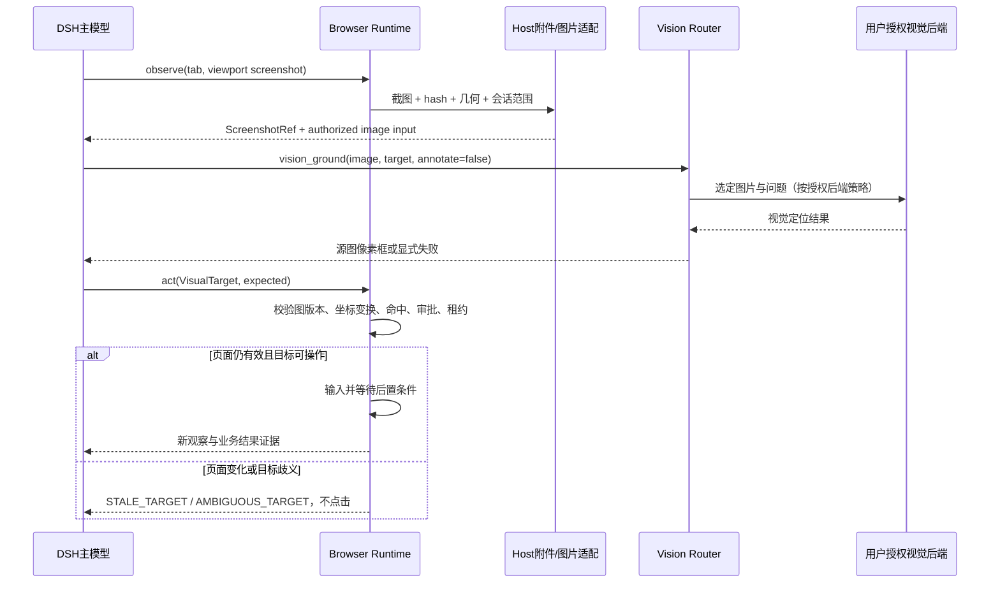

# dsh-vision-router：浏览器视觉适配专项设计

日期：2026-09-11。状态：源码核查完成、接入待实现；没有安装、升级或修改用户的视觉配置，也没有向视觉供应商发送截图。

## 1. 结论

**优先复用 `ysr666/dsh-vision-router`，让它负责看图，让本项目负责浏览器状态、授权、定位校验、点击与结果确认。** 不重复开发完整视觉供应商管理，不依赖它的内部实现，也不让它变成浏览器运行时的必需组件。

核查对象为版本 `2.1.5`、提交 `bfc71385148976279286b0d14fa1779378efa5ff`。主 README 描述按需视觉工具模式与免 Key 云端兜底；这些是项目提供的能力说明，不是本次对云端服务的可用性背书。[^1]

## 2. 已核实的接口与限制

| 项目 | 源码证据 | 对接判断 |
|---|---|---|
| 工具输入 | `vision_ground({image,target,annotate})`；image 支持路径或当前会话授权附件 | 可用我们生成的受控截图，不需要桌面捕获 |
| 工具输出 | JSON 字符串，目标框 `x1/y1/x2/y2/width/height`，可选标注图片；失败可能 `ok:false` 或抛错 | 适配器做 schema 验证与统一错误，不能只判断函数返回 |
| 图片归属 | 附件通过会话索引与 Host attachments 解析；文件通过 DSH fs 服务 | 不能凭 hash 猜出其他会话图片，也不能传 Broker 私有目录而假设 DSH 可读 |
| 坐标包装 | 公开运行时为 ground/detect 加 1000×1000 letterbox，再映回源栅格 | 使用最终公开输出，不重复做 letterbox 逆变换 |
| 包导出 | 包暴露插件入口、client、package 与 patch，非独立视觉服务 SDK | 首期工具协作；不要 import `index.js` 内部执行闭包 |
| 许可证 | 仓库 MIT，需保留相应声明 | 可评估局部代码复用，第三方依赖许可证另查 |

以上依据工具实现、运行时包装、包清单与许可证。[^2][^3][^4][^5] 不能从工具名推断它已经拥有浏览器的租约、站点授权或当前帧身份。

## 3. 推荐接入方式

### A. 首期：标准工具协作，耦合最小

1. `browser_observe({screenshot:'viewport'})` 捕获当前授权标签页，生成 `ScreenshotRef`。
2. DSH adapter 将图片交给 Host 的正式附件入口；若当前版本无法把工具生成图注册为会话可读附件，使用明确授权的 workspace 图片路径作为兼容路线。两条路线都需端到端测试，不能只生成 hash 字符串。
3. 主模型调用 `vision_ground` 或 `vision_describe`。只把此图片与局部问题交给视觉模型，不附送全部浏览器历史。
4. 视觉适配层将有效结果包装为 `VisualTarget`；`browser_act` 再验证截图、几何、权限、租约与实际命中。
5. 动作后重新 observe，根据业务后置条件确认；不以旧图上的框证明新动作成功。

此方案不要求插件之间直接调用私有函数，也不要求首期改造 Vision Router。代价是视觉路径通常多一次模型工具往返，应如实计入延迟。AX 足够时根本不走此路径。

### B. 后续：协商稳定 VisionProvider 服务

若性能数据证明工具协作往返明显拖慢，再与上游约定稳定服务：`describe/ground/detect`，带当前会话、图片授权、deadline、AbortSignal、允许的后端集合和执行来源。所有调用仍经过等价的 DSH 策略，禁止直接绕过工具审批。

如果 DSH 已有公开的跨工具受控调用入口，可验证后复用；本次没有证实这样的稳定入口足以覆盖全部审批、上下文与输出语义，因此不在排期里假定“直接调一下工具函数”就完成。

## 4. 推荐契约

下面是本项目拟定义的内部类型，不是 Vision Router 当前公开接口。

```ts
interface ScreenshotRef {
  id: string; sha256: string;
  tab: string; frame?: string;
  documentEpoch: number; capturedAt: number;
  sourcePixels: { width: number; height: number };
  viewportCss: { width: number; height: number };
  // 从实际交给视觉模型的规范化图片映射到当次 CSS viewport。
  // 裁剪/缩放/方向修正全部计入，不只简单除 DPR。
  imageToViewport: [number, number, number, number, number, number];
  geometryRevision: number;
  input: { kind: "attachment" | "workspace-file"; value: string };
}
interface VisualTarget {
  screenshotId: string; screenshotSha256: string;
  box: { x1: number; y1: number; x2: number; y2: number };
  coordinateSpace: "canonical-image-pixels";
  sourceWidth: number; sourceHeight: number;
  evidence: string;
  // 不伪造一个上游没提供的置信分数。
  confidence?: number;
}
interface VisionProvider {
  describe(input: AuthorizedVisionRequest, signal: AbortSignal): Promise<VisionAnswer>;
  ground(input: AuthorizedVisionRequest, signal: AbortSignal): Promise<VisualTarget>;
}
```

校验顺序：图片 ID/hash 属于当前任务 → 尺寸与坐标有限且合法 → 返回的是规范化源图坐标 → 当前 document/geometry 未失效 → 转换 CSS viewport → frame 转换与 hit-test → 用户授权仍匹配 → 扩展 gate → 输入。候选来自模型，因此坐标格式合法不代表语义正确；必要时局部截图二次确认，仍歧义则停。

如果视口截图不裁剪、不旋转，简单映射可为 `cssX = pixelX * viewportCssWidth / imageWidth`，Y 同理；有裁剪/旋转时必须用记录的变换。截图已经包含滚动后的 viewport，不能再无条件加 scrollOffset。跨帧目标必须标明坐标参考系。



## 5. 配置建议与外发边界

源码 Config 默认启用 `freeFallback`，整轮路由 `routing`、隐形接管 `stealth` 与强制结构化预识别默认关闭；视觉调用有自己的超时预算。[^6] 浏览器产品应保持按需调用，明确展示所用视觉后端；不能让耗时 120 秒的视觉默认预算悄悄覆盖浏览器整个动作 deadline。

建议分两档，而不是自动帮用户切换：

| 场景 | 建议配置/策略 | 验证 |
|---|---|---|
| 非敏感演示截图 | 用户知情选择云端，允许其选定端点 | 记录最终选择的供应商与错误，不承诺免费服务 SLA |
| 已登录业务/内部页面 | 选定受信任后端；若要求本地，则移除全部云端路由并关闭免费 fallback | 检查有效 provider 列表，而不是只看一个开关 |

关键限制：如果我们不能通过公开机制证明 Vision Router 的有效后端链符合该任务的图片外发授权，**不派发该视觉工具调用**；采用 semantic-only 或请用户完成设置。不能只在 Browser Runtime 写一个 allowlist，却允许独立视觉工具把相同图片发往另一个端点。

实现可在 DSH 工具 guard/pre-execute 对本插件生成的截图建立来源追踪，并在视觉调用前核验配置与授权。实际 API 与不同插件顺序必须在 P0 验证；配置切换需冻结单次调用的选择，避免审批后换后端。另行考虑客户端直接调用视觉工具的授权路径，不声称 Browser Runtime 已控制整个 DSH 的所有图像行为。

本地模式不意味着所有工具都离线：逐项审查 provider/fallback、OCR 的模型兜底及其他网络工具。我们只接入描述/定位所需能力，不启用桌面截图或图片搜索。截图裁剪可减小外发范围，但仍需核验坐标变换和任务必要性。

## 6. 首批集成验收

- 插件不存在：AX/DOM 操作正常，视觉能力返回 unavailable，不导致浏览器插件启动失败。
- 图片只含随机标记：视觉答案正确；文本上下文未提前泄露该答案。
- 规范化/裁剪/DPR/缩放/滚动：至少 30 组几何夹具逐一验证正确命中。
- 图过期或用户滚动：旧视觉目标被拒绝/重新观察，不直接点旧坐标。
- 后端超时、429、空答案、非法 JSON、越界框：明确失败；不自动换说法无限重试，不自动切换到未授权渠道。
- 用户 Stop：立即阻止浏览器输入，即使视觉请求尚未终止；迟到的视觉结果不能恢复租约。
- 跨会话附件与猜测短 hash：拒绝；临时图片过期后不可再访问。
- 敏感截图、本地-only 配置：网络监测证明无未授权图片外发；云端演示配置单独测。
- 同一 screenshot 的缓存：键含内容 hash、问题、模型/配置版本与策略域，绝不跨越会话权限复用。

本次仅运行了上游纯坐标变换测试 `grounding-coordinate-frame.test.js`：**5/5 通过**。这验证确定性几何函数，不验证视觉模型准确率，也不表示 DSH 浏览器端到端集成已经通过。

## 7. 来源

[^1]: [项目 README](https://github.com/ysr666/dsh-vision-router/blob/bfc71385148976279286b0d14fa1779378efa5ff/README.md)。
[^2]: [核心工具实现](https://github.com/ysr666/dsh-vision-router/blob/bfc71385148976279286b0d14fa1779378efa5ff/index.js#L3482)。
[^3]: [公开入口](https://github.com/ysr666/dsh-vision-router/blob/bfc71385148976279286b0d14fa1779378efa5ff/lib/public-entry.js)、[运行时坐标包装](https://github.com/ysr666/dsh-vision-router/blob/bfc71385148976279286b0d14fa1779378efa5ff/lib/grounding-coordinate-runtime.js)。
[^4]: [附件句柄权限处理](https://github.com/ysr666/dsh-vision-router/blob/bfc71385148976279286b0d14fa1779378efa5ff/lib/vision-attachment-handle-runtime.js)。
[^5]: [包清单](https://github.com/ysr666/dsh-vision-router/blob/bfc71385148976279286b0d14fa1779378efa5ff/package.json)、[LICENSE](https://github.com/ysr666/dsh-vision-router/blob/bfc71385148976279286b0d14fa1779378efa5ff/LICENSE)。
[^6]: [配置定义](https://github.com/ysr666/dsh-vision-router/blob/bfc71385148976279286b0d14fa1779378efa5ff/index.js#L148)。
