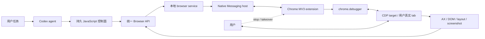

# Codex Chrome 浏览器操作：实现拆解与 DSH 对标方案

> 调研日期：2026-09-11
>
> 研究对象：ChatGPT/Codex Desktop 本机 Chrome 集成、Chrome 官方扩展机制、DSH 插件体系及相邻开源方案
>
> 结论用途：指导 `dsh-native-browser` 的 Chrome-first 架构与验收标准

## 执行摘要

Codex 操作 Chrome 的“丝滑感”不是来自某个神奇的 click API，而是一套从浏览器接入、状态建模、语义观察、动作可靠性、生命周期到人机交接的完整系统。

公开产品文档能确认：ChatGPT/Codex 可以通过浏览器扩展操作用户已有的 Chrome profile、登录态、标签页和扩展；浏览器需要授予 debugger、全站点数据、历史、下载、Native Messaging、tab group 等权限；产品层仍会叠加网站 allowlist/blocklist 和敏感动作确认。[^1] Chrome 官方文档进一步说明，`chrome.debugger` 是扩展访问 Chrome DevTools Protocol（CDP）的传输层，而 Native Messaging 可以把扩展的 service worker 连接到本机进程。[^2][^3]

本机已安装构件提供了公开文档之外的实现证据：当前 Chrome 扩展是 Manifest V3，后台为 service worker；它使用 `chrome.debugger`、`chrome.runtime.connectNative()`、tabs/tabGroups/webNavigation/downloads 等 API，并通过一个受 extension origin 限制的 native host 回到桌面端。Codex 浏览器服务在模型侧呈现为一个持久、按需展开的对象图，而不是几十个永远注入上下文的独立工具。浏览器状态主要通过 Accessibility（AX）树、DOM/layout 补充和必要时截图获得。动作前会重新解析目标、滚入视图、等待稳定并检查命中目标，动作后再返回变化后的状态。[^11][^12]

真正值得对标的七个点是：

1. **复用真实 Chrome 状态。** 扩展附着现有 tab，不要求关闭 Chrome 或复制 profile。
2. **状态化控制面。** browser、tab、locator、订阅和 turn 状态持续存在，减少反复初始化。
3. **AX-first 增量观察。** 首次给全量语义树，之后优先返回 diff；截图是视觉兜底。
4. **动作事务而不是裸指令。** resolve → scroll → stable → hit-test → input → settle → observe。
5. **稳定身份和失效检测。** tab、节点和连接都有代际，页面变化后旧引用不会盲目点到新元素。
6. **人机共享控制。** 用户能看见当前 tab、打断操作、完成登录/验证码，再把控制权交回。
7. **产品级生命周期与安全。** tab claim、临时 tab 回收、deliverable/handoff、网站权限、敏感动作确认共同工作。

因此，`dsh-native-browser` 不应从“再注册一组 browser_click/browser_type 工具”开始。正确路径是先做 Chrome 扩展、Native Messaging、本地状态运行时、tab lease 和 AX/action 内核，再接入 DSH 工具层。Chrome 做好之前不扩展到 Edge 或其它浏览器。

## 1. 研究问题与证据方法

本研究回答四个问题：

- Codex 通过什么链路控制用户真实 Chrome？
- 哪些机制共同产生低延迟、低失败率和可接管的体验？
- 哪些属于可验证事实，哪些只能作为合理推断？
- 在 DSH 中怎样实现有差异化且能达到相同体验等级的 Chrome 插件？

证据分三级：

| 级别 | 来源 | 可支持的结论 |
|---|---|---|
| A | OpenAI、Chrome、CDP、DeepSeek Harness 官方文档 | 产品边界、平台契约、公开 API 与 DSH 插件规范 |
| B | 本机安装的 Codex bundle、扩展 manifest、native-host 配置和运行时代码 | 当前版本的实际模块、权限、命令和状态模型 |
| C | BrowserSkill、Playwright、Browser Use、Stagehand 等一手项目资料 | 可迁移的工程模式与生态比较 |

本机 proprietary bundle 仅用于行为和架构研究。报告不复制其源代码、不公开本机绝对路径、用户标识或私有凭证，也不把某个压缩变量名当成稳定 API。

## 2. 已确认的端到端链路



### 2.1 产品入口

OpenAI 的浏览器扩展文档把 Chrome 作为桌面端 Computer Use 的一个可选 surface。用户安装扩展后，在新任务中选择 Chrome 或直接提及一个已打开的 tab。与内置浏览器不同，这条路径明确复用用户常用浏览器的 profile、已登录 session、已有 tab 和其它 Chrome 扩展。[^1][^4]

这个产品选择很关键。Playwright 的 persistent context 或 `--remote-debugging-port` 也能复用部分状态，但常常要求独占 profile、用测试启动参数重启浏览器，或者复制数据目录。扩展路线可以进入一个正在运行、用户正在使用的 Chrome。

### 2.2 Manifest V3 扩展

本机扩展 manifest 显示它是 Manifest V3，后台入口是 service worker，并声明 `debugger`、`nativeMessaging`、`tabs`、`tabGroups`、`scripting`、`webNavigation`、`downloads`、`history` 等权限以及广泛 host permission。公开文档列出的用户可见权限与之吻合。[^1][^11]

Manifest V3 service worker 不是常驻后台页。Chrome 会在空闲时终止它，之后由事件重新唤醒；全局变量会丢失，所以扩展必须把重要状态放进 storage 或本地运行时，并能重建连接。Chrome 105 起，活跃 Native Messaging port 可以维持 service worker；Chrome 118 起，活跃 debugger session 也会延长其生命周期，但正确实现仍需能承受意外终止。[^5]

这解释了为什么“连上一次就假设永远在线”的简单 WebSocket 扩展常常不稳定。对标实现必须把重连、epoch 和状态重放设计进协议，而不是当作异常补丁。

### 2.3 Native Messaging

扩展通过 `chrome.runtime.connectNative()` 打开长期连接。本机配置指向受允许 extension origins 限制的本地 host，host 与扩展通过 stdin/stdout 的带长度前缀 UTF-8 JSON 交换消息。Chrome 官方文档确认：长期 port 会保持 host 进程；manifest 规定 host 名称、可执行路径、`stdio` 类型和精确的 `allowed_origins`。[^3][^11]

Native Messaging 的优势：

- 没有公开监听端口；
- Chrome 负责根据 extension origin 决定能否启动 host；
- host 生命周期与扩展 port 绑定；
- 跨 macOS、Windows、Linux 有官方安装位置和协议。

它不是完整安全方案。native host 仍须校验协议版本、连接身份、消息大小、请求所有权和取消状态；安装器还要正确设置文件权限与卸载清理。

### 2.4 `chrome.debugger` 与 CDP

扩展使用 `chrome.debugger.attach()` 附着目标 tab，使用 `sendCommand()` 发送 CDP 命令，并消费 `onEvent`/`onDetach`。Chrome 将 `chrome.debugger` 定义为远程调试协议的替代传输，可以针对 tab、iframe 和 worker target 调用 CDP。[^2]

本机运行时代码可确认使用到的能力族包括：

- Accessibility：启用 AX、取全树、接收节点变化；
- DOM/DOMSnapshot：解析 backend node、捕获结构、获取 content quads 和 box model；
- Runtime：在受控节点上下文中读取或调用函数；
- Input：鼠标、键盘和文本输入；
- Page：导航、截图、对话框、下载和生命周期；
- Target：跨进程 iframe 和 child targets。

CDP 官方文档指出，启用 Accessibility domain 后，AX node id 会在方法调用之间保持一致；Input domain 提供鼠标、键盘、文本和拖动事件。[^6][^7] 这为稳定语义观察与不移动系统鼠标的页面内输入提供了基础。

## 3. 模型看到的不是底层 CDP

Codex 的模型控制面保持很小：一个持久 JavaScript REPL 加动态提供的 browser 对象。首次拿到浏览器或 tab 后，后续调用可以复用对象；API 文档按需加载，而不是把几十个 JSON Schema 常驻在每次模型请求中。[^12]

本机 API surface 中可识别的概念包括：

- 浏览器实例枚举、选择与能力声明；
- 用户当前打开 tab 的候选列表和 claim；
- 新建、查询和选中 tab；
- 导航、前进、后退、刷新、关闭、标题与 URL；
- AX state/actions、Playwright 风格 locator、截图、剪贴板和页面内容；
- deliverable/handoff 标记与 turn 结束处理。

这不是把 CDP socket 交给模型。复杂 live object 保留在可信运行时，模型仅编排 capability。其收益有三点：

1. 一次 JS 工具调用可以执行多个便宜动作和条件分支，减少模型—工具往返。
2. 句柄与事件订阅保存在运行时，不必序列化回模型上下文。
3. API 可根据 browser backend 能力变化，而不改变整体交互范式。

对于 DSH，持久 JS façade 是值得实验的方向，但不能直接使用 Node `vm` 就宣称安全。Codex 本机实现中的页面 evaluate 明确做了只读限制、冻结内建对象、禁用模块加载、限制序列化深度与大小，并阻止 live DOM wrapper 穿越边界。[^12] 我们应先做 typed tools，等沙箱逃逸测试成熟后再决定是否用 JS façade。

## 4. “丝滑”的具体来源

### 4.1 状态持久，不反复冷启动

低质量 browser agent 经常把每个动作都当成独立任务：重新连接浏览器、枚举 page、抓整页、点击、再重新连接。这会把毫秒级页面动作放大成秒级工具往返。

Codex 的 browser/tab 句柄、观察缓存、连接和事件订阅跨调用存在；多个顺序动作可在一个 JS 调用中执行。进程、扩展和 CDP attachment 的冷启动成本被摊销。[^12]

对标要求：`dsh-native-browser` 必须有 per-DSH-session 的常驻 `BrowserRuntime`，而不是工具函数内部临时启动 Chrome 客户端。

### 4.2 AX-first，而不是 screenshot-first

本机浏览器使用说明明确建议：优先读取 AX state；每次动作后获取最新 AX，重复工作或已知结构再用 locator；只有语义不足时才截图。AX 结果可以是相对上一代的增量变化。[^12]

AX 对模型友好，因为 role、name、value、selected、expanded、disabled 等字段与用户认知接近，并且比 HTML 和图片紧凑。CDP Accessibility domain 还提供稳定 AXNodeId 和局部树能力。[^6]

但 AX 不是万能的。canvas、地图、图表、复杂编辑器、无障碍实现差的网站需要 DOM/layout 或视觉补充。因此正确策略是“AX 默认、DOM 精确补充、截图按需”，而不是只选一种模态。

### 4.3 增量观察减少 token 与视觉等待

整页 AX/DOM 每次都返回会造成三种问题：

- 大量不变文本反复进入上下文；
- 元素数组重新编号，旧 ref 容易错位；
- 模型需要重新理解整个页面才能找到一个小变化。

Codex 通过 observation cache 和 AX event 形成 diff，只突出新增、改变和删除节点。[^12] 对标实现应让 diff 带 `baseGeneration`，一旦事件丢失就明确回退到 full snapshot，不能根据残缺状态猜测。

### 4.4 动作前重新解析和 actionability

网页在观察和点击之间可能因 React/Vue 重渲染替换节点。可靠 locator 不能只保存旧 DOM object 或坐标。Playwright 的 locator 会在每次动作时重新找到元素；click 前检查唯一、可见、稳定、可接收事件和启用。[^8][^9]

本机 Codex 动作内核可观察到类似但更贴合 AX/CDP 的流程：从 AX ref 解析 backend DOM node，获取 content quad，跨 frame 映射坐标，滚入视图，短时间采样是否稳定，执行 hit-test，遇到遮挡或过期则失败，最后通过 CDP Input 派发。[^12]

这是丝滑感最重要的可靠性来源之一。它把“点错了以后看截图再补救”变成“动作前发现不能安全点击并返回具体原因”。

### 4.5 动作后自动等待的是“有用状态”

固定 `sleep(2s)` 既慢又不可靠。动作可能触发：同步 DOM change、异步请求、同页路由、完整导航、新 tab、dialog 或 download。Codex 监听 CDP 和 Chrome 生命周期事件，把可能发生的 navigation 与动作绑定，再在有界条件下等待并生成后续 observation。[^12]

对标实现需要一个 settle coordinator，而不是所有动作统一 sleep：

- 若检测到 navigation，等待 commit 和最小可交互状态；
- 若只有 AX/DOM change，等待短暂 quiet window；
- 若出现 dialog/download/new tab，立即返回结构化 side effect；
- 达到超时后返回当前状态和“仍在加载”标志，不无限等待。

### 4.6 页面内输入不会抢系统鼠标

CDP Input 直接对目标页面派发鼠标和键盘事件，普通动作不会移动用户桌面的真实光标。[^7] 这比操作系统级自动化更稳定，也允许用户继续使用其它应用。但如果用户正在操作同一个受控 tab，仍可能发生竞态，因此需要 human-intervention epoch，而不是假设“系统鼠标没动就没有冲突”。

### 4.7 Tab 生命周期让结果保持干净

本机文档区分用户现有 tab 与 agent 创建 tab：claim 必须基于刚列出的候选信息，title/URL 变化就拒绝；临时创建 tab 在 turn 结束自动回收，用户需要继续看的结果标为 deliverable，需要登录、验证码或人工输入的标为 handoff。[^12]

生命周期不是“体验润色”。没有 ownership/cleanup，多个 DSH task 会串 tab、关闭用户页面，或留下大量中间搜索页。`dsh-native-browser` 必须让 lease 和 disposition 成为协议一等概念。

### 4.8 用户打断是一等事件

Codex 的扩展和运行时把用户 stop/interrupt 作为控制流事件：终止当前操作、保留可理解的页面状态，并让模型自然地说明已停止，而不是继续重试。[^12]

DSH 已有 cancellation signal 和可逆 Cordis 生命周期，适合作为底层。插件还需要把扩展 UI 的 stop 与 DSH 当前 operation/turn 对齐。

### 4.9 安全确认与动作执行分层

OpenAI 公开文档说明：网站访问默认按 host 询问，用户可一次允许、长期允许、全局允许或 block；历史访问单独询问；提交信息、购买、权限变更、删除等敏感动作有动作时确认。网页内容仍被视为不可信。[^1][^4]

这意味着扩展权限回答“技术上能不能做”，产品 policy 回答“这次是否应该做”。`debugger`/`<all_urls>` 的宽权限不能替代逐动作治理。

## 5. 内置浏览器与 Chrome 路线的区别

Codex/ChatGPT 内置浏览器使用独立 browser state，在 App 内与用户共享页面；Chrome 扩展路线使用常规 Chrome profile。官方文档建议：本地开发、公开页面或希望留在 App 内的任务用内置浏览器；需要现有登录态、cookies、tabs 或 Chrome extensions 时用扩展。[^4]

本项目明确选择后者。原因不是内置浏览器价值低，而是：

- 用户要求先把 Chrome 做到非常好；
- DSH 已有 Electron/shared-browser 类插件；
- 真实 profile 的低摩擦 authenticated workflow 是当前市场缺口；
- 同时做 embedded browser 会分散生命周期、安全和跨平台测试资源。

因此架构只在内部保留 provider 边界，不在 MVP 承诺通用 browser abstraction。

## 6. DSH 插件体系与落点

DeepSeek Harness 基于 Cordis：工具、模型、session、审批和 UI 都是可替换插件；注册是可逆 effect，插件卸载时自动清理。profile 由有序 bundle patch 组合。一个可通过 `dsh plugin --profile <name> add <package>` 安装的包，必须在 `package.json` 声明 `dsh.bundle.patch`，patch 再插入实际插件 row。[^13][^14]

这决定了仓库的分层：

```text
DSH bundle metadata
  -> Cordis BrowserRuntime service
  -> model-facing tools / prompt guidance
  -> lifecycle + approval adapters
  -> protocol client
  -> native host
  -> Chrome extension
```

第一版不应把 extension/native-host 生命周期藏在每个 tool 的 `execute()` 中。DSH service 应长驻并持有连接；tool 只校验参数、调用 service、观察 `exec.signal`，再把规范化结果渲染给模型。DSH 官方 `defineTool` 还要求参数与 canonical output schema，并把 cancellation signal 放在执行上下文。[^15]

当前仓库先放 capability-free bundle scaffold 是有意设计：可以验证 npm/DSH metadata，而不会让市场用户安装一个声明能控制 Chrome、实际却没有安全闭环的半成品。

## 7. 相邻方案比较

### Tencent BrowserSkill

BrowserSkill 是当前 DSH 方向最值得参考的开源项目。它采用 CLI/daemon + Chrome/Edge extension，并提供 DSH bundle；可以使用真实已登录浏览器，强调 session、借用/归还 tab、可视状态和中断。[^16]

可以直接借鉴：协议版本化、独立 eval fixtures、session ownership、Web UI overlay、工具按需暴露。需要差异化的地方：更深的 DSH-native service/lifecycle 集成、AX generation/diff、一致的 actionability transaction，以及最终可能的持久 JS façade。

### dsh-builtin-browser

本机已安装的 `dsh-builtin-browser` 提供 Electron 自托管窗口、`ctx.browser` seam、task 隔离、CDP、挑战检测、表单、下载和大量 `browser_*` tools。它更接近 Codex 的内置浏览器，而不是现有 Chrome profile 扩展。[^17]

它证明了 DSH 中 service/provider/tool 三层是可行的，也提示我们不要再造一个只改变工具名字的同类 Electron 插件。

### Browser Use

Browser Use 的公开 CLI 也采用持久 browser：`open`、`state`、`click` 等命令之间保持浏览器运行，并提供面向 agent 的 browser harness 和 recovery loops。[^18] 它说明状态化 browser harness 已成为主流方向，但其 Python/Rust/云生态与 DSH 本地 Chrome extension 的产品边界不同。

### Stagehand

Stagehand 把 AI observe/act 与精确代码、cache/self-healing 结合，适合把探索过程固化为可重复 workflow。[^19] 这对未来的 action cache 有启发，但本项目最先要解决的是实时、人机共享的 Chrome 控制，而不是云浏览器规模化执行。

### Playwright

Playwright 是 locator/actionability 的优秀参考，也适合作为部分执行引擎或测试 oracle。但直接 `connectOverCDP` 并不自动提供 extension 安装、tab ownership、MV3 重连、人机 stop、DSH approval、AX diff 和 turn cleanup。[^8][^9]

## 8. 可复制、不可复制与不应复制

### 可以直接复制的工程原则

- Native Messaging + `chrome.debugger` 的官方接入模式；
- AX/DOM/screenshot 分层观察；
- locator 每次动作重新解析；
- actionability、hit-test 和 bounded settle；
- tab claim/lease/disposition；
- connection epoch、event sequence 和 idempotent cleanup；
- DSH Cordis service + thin tools + lifecycle hooks；
- 性能与正确性 benchmark gates。

### 需要独立设计的部分

- Codex 私有 browser service 的 wire protocol；
- 持久 JS REPL 沙箱；
- OpenAI 内部 policy classifier；
- App 与扩展的身份认证和发行签名体系；
- 页面批注的 UI/DOM anchoring；
- 特定模型的 prompt 和 tool selection 策略。

### 不应复制的部分

- 不暴露用户 cookie、Authorization header、password 或 OTP 给模型；
- 不提供默认 unrestricted CDP；
- 不依赖一个公开 localhost port 且没有认证；
- 不用数组下标冒充稳定 element id；
- 不用固定 sleep 冒充 settle；
- 不让网页文本授予权限或更改 agent policy；
- 不把 CAPTCHA 绕过、反检测或 stealth 当产品承诺。

## 9. Chrome-first 推荐架构

详细设计见 `docs/architecture.md`。核心数据流为：

1. DSH BrowserRuntime 与 native host 完成 versioned/authenticated handshake。
2. native host 与 MV3 extension 建立长期 port，生成新的 connection epoch。
3. agent 请求候选 tab；runtime 返回模型安全的 opaque candidate。
4. claim 再验证候选 token、title、URL 与 epoch，创建 lease。
5. extension 通过 `chrome.debugger` attach，启用 AX 与必要 CDP domains。
6. 首次 observe 生成 compact full AX；后续主要生成 generation-bound diff。
7. action 经过 lease/policy/freshness/actionability transaction。
8. action result 携带新 observation 和 side effects。
9. user stop/DSH cancellation 立即中止 operation；handoff 可显式 resume。
10. turn end 根据 ephemeral/deliverable/handoff 回收或保留 tab。

模型-facing API 先从小型 typed tools 起步：connect/status、tab acquire、observe、act、handoff。待真实 benchmark 证明 JS batching 的收益且沙箱通过安全测试后，再引入 `browser_js`。

## 10. 量化“丝滑”，避免主观对标

“像 Codex 一样丝滑”需要拆成可测指标：

| 体验维度 | 指标 | Beta 目标 |
|---|---|---:|
| 连接 | warm status/observe | p50 < 150 ms，p95 < 500 ms |
| 动作 | click 到 useful diff（非真实导航） | p50 < 350 ms，p95 < 1.5 s |
| 上下文 | diff 相对 full snapshot 字节数 | median 减少 >= 60% |
| 正确性 | stale ref 造成错误点击 | 0 |
| 隔离 | 跨 task 控制其它 tab | 0 |
| 生命周期 | normal/interrupt/crash 后临时 tab 泄漏 | 0 |
| 人机协作 | stop 到 operation cancel | p95 < 250 ms |
| MV3 韧性 | service-worker restart 恢复 | >= 99% |

测试必须包含 React 重渲染、动画、遮罩、iframe、Shadow DOM、dialog/download、用户中途点击、extension suspension、native host crash、两个同名同 URL tab 等故障场景。真实网站测试只能作为补充，稳定本地 fixture 才能做回归门禁。

## 11. 实施顺序

### Phase 1：先打通连接与所有权

完成 extension、native host、doctor/uninstall、handshake、reconnect、candidate/claim/create/release 和 DSH service。此时还不追求大量动作。

### Phase 2：做窄而深的语义闭环

只实现 observe、navigate、click、type，但把 AX generation、frame mapping、scroll、stability、hit-test、settle、cancellation 和 structured failure 做完整。一个可靠 click 比二十个脆弱工具更有价值。

### Phase 3：人机协作与 lifecycle

加入 controlled-tab indicator、stop/takeover/resume、handoff、deliverable 与 turn cleanup，再接 DSH UI。

### Phase 4：生产工作流

补 select/check/fill、downloads、dialogs、file chooser、screenshot fallback、approval、redaction 与审计。

### Phase 5：控制面优化

在相同任务集上比较 typed tools 与 persistent JS façade。只有当 JS 方案在延迟、token 和成功率上显著胜出且安全边界可证明时才采用。

## 12. 主要风险

### Chrome Web Store 与宽权限

`debugger` 和 `<all_urls>` 会触发高敏权限审查，也会影响用户信任。必须给出逐权限解释、最小数据留存、明确状态 UI 和可验证的卸载清理。扩展源码与 native host 最好完全开源、构建可复现。

### MV3 service worker 不稳定常驻

service worker 会休眠，extension update/reload 也会断开 attachment。epoch + replay + fail-closed 是基础协议，不是后补功能。

### 用户与 agent 同时操作

不移动系统鼠标不等于没有竞态。需要区分被动 focus 与真实 input，并在动作的每个等待边界检查 human-interaction epoch。

### 页面 prompt injection

AX、DOM、截图、下载和历史都可能包含恶意指令。runtime 只把它们作为页面数据；权限决定来自 DSH policy 和用户，不来自网页。

### DSH RC 版本变化

DSH 当前仍是 `0.1.5-rc` 系列。Cordis/tool/output contracts 可能变化。bundle compatibility 必须精确声明，并在每个支持版本上运行 `--dump-config` 与 lifecycle tests。[^13][^15]

## 13. 最终判断

市场不是没有 browser automation；Browser Use、Stagehand、Playwright 和 BrowserSkill 都很强。真正相对空缺的是：**面向 DSH、直接操作用户真实 Chrome、拥有 Codex 等级的状态化语义观察、动作事务、tab 生命周期和人机接管的一体化插件。**

这个机会成立，但壁垒不会是工具数量，而是以下系统能力的组合：

- Chrome profile 的无摩擦接入；
- AX diff 和稳定引用带来的低 token、低等待；
- actionability 与结构化失败带来的低误操作；
- ownership/cleanup 带来的多任务可靠性；
- stop/handoff 带来的用户信任；
- permission/approval/redaction 带来的安全可部署性；
- 可复现 benchmark 带来的可信质量承诺。

因此，本项目当前的 Chrome-only 决策是正确的。先完成一条极窄但完整的垂直链路，再增加能力；不要为“支持更多浏览器”牺牲最难也最有价值的体验工程。

## Sources

1. OpenAI, [Browser extension](https://learn.chatgpt.com/docs/chrome-extension), accessed 2026-09-11.
2. Chrome for Developers, [chrome.debugger API](https://developer.chrome.com/docs/extensions/reference/api/debugger), accessed 2026-09-11.
3. Chrome for Developers, [Native messaging](https://developer.chrome.com/docs/extensions/develop/concepts/native-messaging), accessed 2026-09-11.
4. OpenAI, [Browser](https://learn.chatgpt.com/docs/browser?surface=app), accessed 2026-09-11.
5. Chrome for Developers, [The extension service worker lifecycle](https://developer.chrome.com/docs/extensions/develop/concepts/service-workers/lifecycle), accessed 2026-09-11.
6. Chrome DevTools Protocol, [Accessibility domain](https://chromedevtools.github.io/devtools-protocol/tot/Accessibility/), accessed 2026-09-11.
7. Chrome DevTools Protocol, [Input domain](https://chromedevtools.github.io/devtools-protocol/tot/Input/), accessed 2026-09-11.
8. Playwright, [Locators](https://playwright.dev/docs/locators), accessed 2026-09-11.
9. Playwright, [Auto-waiting and actionability](https://playwright.dev/docs/actionability), accessed 2026-09-11.
10. Chrome DevTools Protocol, [DOMSnapshot domain](https://chromedevtools.github.io/devtools-protocol/tot/DOMSnapshot/), accessed 2026-09-11.
11. Local installed ChatGPT Chrome extension manifest/background and Native Messaging configuration, extension `1.26.901.11451`, inspected 2026-09-11. Not publicly accessible.
12. Local Codex bundled Chrome/browser/computer-use documentation and runtime, desktop bundle `26.903.71938`, inspected 2026-09-11. Not publicly accessible.
13. DeepSeek AI, [DeepSeek Harness architecture](https://github.com/deepseek-ai/deepseek-harness/blob/master/docs/architecture.md), accessed 2026-09-11.
14. DeepSeek AI, [Package and install a plugin](https://github.com/deepseek-ai/deepseek-harness/blob/master/docs/user/develop/basic/publish.md), accessed 2026-09-11.
15. DeepSeek AI, [Tool authoring reference](https://github.com/deepseek-ai/deepseek-harness/blob/master/docs/cookbook/adding-a-tool.md), accessed 2026-09-11.
16. Tencent, [BrowserSkill](https://github.com/Tencent/BrowserSkill), accessed 2026-09-11.
17. wqty123, [dsh-browser](https://github.com/wqty123/dsh-browser), accessed 2026-09-11.
18. Browser Use, [browser-use](https://github.com/browser-use/browser-use), accessed 2026-09-11.
19. Browserbase, [Stagehand](https://github.com/browserbase/stagehand), accessed 2026-09-11.

[^1]: OpenAI, “Browser extension,” especially setup, website access and permission sections.
[^2]: Chrome for Developers, “chrome.debugger API.”
[^3]: Chrome for Developers, “Native messaging.”
[^4]: OpenAI, “Browser,” and OpenAI Help Center, “Using the built-in browser in the ChatGPT desktop app.”
[^5]: Chrome for Developers, “The extension service worker lifecycle.”
[^6]: Chrome DevTools Protocol, “Accessibility domain.”
[^7]: Chrome DevTools Protocol, “Input domain.”
[^8]: Playwright, “Locators.”
[^9]: Playwright, “Auto-waiting and actionability.”
[^10]: Chrome DevTools Protocol, “DOMSnapshot domain.”
[^11]: Local installed ChatGPT Chrome extension and Native Messaging evidence, inspected 2026-09-11.
[^12]: Local Codex bundled Chrome/browser/computer-use runtime and documentation, inspected 2026-09-11.
[^13]: DeepSeek AI, “DeepSeek Harness architecture.”
[^14]: DeepSeek AI, “Package and install a plugin.”
[^15]: DeepSeek AI, “Tool authoring reference.”
[^16]: Tencent, “BrowserSkill.”
[^17]: wqty123, “dsh-browser.”
[^18]: Browser Use, “browser-use.”
[^19]: Browserbase, “Stagehand.”
